# Детектирование и трекинг движущихся объектов методами компьютерного зрения

**Выпускная квалификационная работа бакалавра**
- Организация: Московский авиационный институт (национальный исследовательский университет)
- Институт / кафедра: Компьютерные науки и прикладная математика, кафедра 806
- Группа: М8О-411Б-20
- Направление подготовки: 02.03.02 Фундаментальная информатика и информационные технологии
- Профиль: Информатика и компьютерные науки
- Автор: Нурмухамедов Абубакир Бобурович
- Руководитель: Филимонов Александр Борисович
- Год: 2024

## РЕФЕРАТ

Выпускная квалификационная работа бакалавра состоит из 46 страниц, 30 рисунков, 22 использованных источников, 1 приложения. АЛГОРИТМ ДЕТЕКТИРОВАНИЯ, АЛГОРИТМ РАСПОЗНАВАНИЯ, АЛГОРИТМ ТРЕКИНГА, МАШИНОЕ ОБУЧЕНИЕ, НЕЙРОННАЯ СЕТЬ YOLOv8, ТРЕКЕР DEEPSORT Объектом исследования в данной работе является система обеспечения безопасности в аэропортах. Цель работы – реализация метода детектирования и трекинга движущихся объектов для видеонаблюдения охраняемых зон и периметра аэропорта. Для достижения поставленной цели были проведены исследования в области компьютерного зрения, обработки изображений и видео, а также применены современные методы машинного обучения и нейронных сетей. Основное содержание работы состояло в разработке алгоритмов детектирования, распознавания и трекинга. Основными результатами работы, полученными в процессе разработки, являются реализация системы детектирования движущихся объектов в зоне видеонаблюдения, создание модуля распознавания объектов, который обеспечивает классификацию обнаруженных объектов на основе заранее обученной нейронной сети, внедрение алгоритма трекинга объектов, позволяющего отслеживать движение объектов в реальном времени с использованием фильтра Калмана, подготовка и аннотирование специализированного датасета изображений и видео для обучения и тестирования нейронной сети YOLO. Применение результатов данной работы позволяет повысить эффективность систем видеонаблюдения охраняемых зон, обеспечивая быстрое и точное обнаружение, распознавание и отслеживание движущихся объектов.

## СОДЕРЖАНИЕ

ТЕРМИНЫ И ОПРЕДЕЛЕНИЯ ........................................................................ 5

ПЕРЕЧЕНЬ СОКРАЩЕНИЙ И ОБОЗНАЧЕНИЙ........................................... 6

ВВЕДЕНИЕ ......................................................................................................... 7

1 СИСТЕМА ОХРАННОГО ВИДЕОНАБЛЮДЕНИЯ АЭРОПОРТА .......... 9

1.1 Проблемы видеонаблюдения в аэропортах .............................................. 9

1.2 Архитектура системы охранного видеонаблюдения аэропорта .......... 11

1.3 Решаемые задачи обработки видеоданных ............................................ 13

2 Обнаружение проникновения в охраняемую зону ..................................... 15

2.1 Основы детектирования объектов ........................................................... 15

2.2 Алгоритм детектирования ........................................................................ 16

2.2.1 Вычитание фона ..................................................................................... 16

2.2.2 Обнаружение контуров .......................................................................... 18

2.2.3 Рисования контуров ............................................................................... 19

2.2.4 Улучшение обнаружения контуров ...................................................... 20

3 РАСПОЗНАВАНИЕ ДВИЖУЩИХСЯ ОБЪЕКТОВ ................................. 25

3.1 Выбор метода распознавания .................................................................. 25

3.2 Обзор нейронной сети YOLO .................................................................. 26

3.3 Обучение нейронной сети и используемый датасет ............................. 28

3.4 Подключение обученной модели ............................................................ 30

3.4 Результаты.................................................................................................. 31

4 ТРЕКИНГ ОБЪЕКТОВ НАБЛЮДЕНИЯ .................................................... 33

4.1 Метод трекинга DeepSORT ...................................................................... 33

4.2 Реализация алгоритма трекинга............................................................... 35

4.3 Сохранение записей обнаружений в базу данных ................................. 38

4.4 Уведомление операторам об обнаружении ............................................ 40

4.5 Результаты.................................................................................................. 41

ЗАКЛЮЧЕНИЕ ................................................................................................. 43

СПИСОК ИСПОЛЬЗОВАННЫХ ИСТОЧНИКОВ ....................................... 44

## ТЕРМИНЫ И ОПРЕДЕЛЕНИЯ

В настоящей выпускной квалификационной работе бакалавра применяют следующие термины с соответствующими определениями:

- Датасет – набор данных, используемых для обучения и тестирования моделей машинного обучения или компьютерного зрения

- Нейроная сеть – алгоритм машинного обучения, моделирующий работу нервной системы человека, используемый для решения различных задач, включая классификацию, детектирование и распознавание объектов

## ПЕРЕЧЕНЬ СОКРАЩЕНИЙ И ОБОЗНАЧЕНИЙ

В настоящей выпускной квалификационной работе бакалавра применяют следующие сокращения и обозначения:

- OpenCV – Open Source Computer Vision Library

- YOLO – You Only Live Once

- СNN – Convolutional Neural Networks

- NMS – Non-Maximum Suppression

- R-CNN – Region-based Convolutional Neural Networks

- HOG – Histogram of Oriented Gradients

## ВВЕДЕНИЕ

В современном мире безопасность является одним из приоритетов, особенно в таких местах, как аэропорты, где обеспечение безопасности оборудования и людей играет решающую роль. Одним из наиболее эффективных методов обеспечения безопасности является использование технологий компьютерного зрения для детектирования и трекинга движущихся объектов. Системы детектирования и трекинга движущихся объектов с использованием компьютерного зрения становятся важным инструментом для обеспечения безопасности в различных сферах, включая транспортные узлы, такие как аэропорты. Актуальность данной темы обусловлена несколькими факторами: Во-первых, угрозы безопасности в современном мире продолжают расти. Террористические акты, акты вандализма, кражи и другие непредвиденные ситуации становятся все более частыми. Эффективные системы детектирования и трекинга могут помочь в раннем обнаружении и предотвращении таких угроз. Во-вторых, в аэропортах находится ценное оборудование и техника, такие как самолеты, технические средства обслуживания и различные материалы. Обеспечение их безопасности имеет критическое значение для непрерывной работы аэропортов и предотвращения экономических потерь. В-третьих, законодательство в области безопасности авиации строго регулирует требования к безопасности в аэропортах. Разработка и внедрение передовых систем безопасности помогают администрации аэропортов соответствовать данным требованиям. Внедрение систем детектирования и трекинга движущихся объектов в аэропортах - это актуальная задача, которая может значительно улучшить уровень безопасности и эффективности деятельности воздушных транспортных узлов. Данная работа посвящена проблематике проектирования системы видеонаблюдения для обеспечения безопасности в аэропорту с

использованием библиотеки OpenCV и архитектуры нейронной сети YOLO для обнаружения объектов в реальном времени. Целью выпускной квалификационной работы является реализация метода детектирования и трекинга движущихся объектов для видеонаблюдения охраняемых зон и периметра аэропорта. Задачи, определяемые поставленной целью:

- Изучение существующих подходов и методов обеспечения безопасности с помощью видеонаблюдения в аэропортах.

- Изучение библиотеки OpenCV и архитектуры YOLO для обнаружения объектов на видеопотоке.

- Подготовка датасета изображений для обучения нейронной сети YOLO на конкретные классы объектов.

- Обучение и настройка модели YOLO на собранном датасете с использованием OpenCV для обработки изображений.

- Реализация методов обнаружения и классификации объектов на видеопотоке из аэропортовских камер наблюдения с использованием обученной модели YOLO и OpenCV. Объектом исследования является система обеспечения безопасности в аэропортах. Данный объект включает все компоненты и процессы, связанные с обеспечением безопасности в охраняемых зонах аэропортов, включая периметральные оборонительные системы, внутренние видеонаблюдательные системы, процессы проверки на доступ и контрольно-пропускные пункты. Предметом исследования является реализация системы детектирования и трекинга движущихся объектов с использованием технологий компьютерного зрения в рамках системы обеспечения безопасности аэропортов.

## 1 СИСТЕМА ОХРАННОГО ВИДЕОНАБЛЮДЕНИЯ АЭРОПОРТА

### 1.1 Проблемы видеонаблюдения в аэропортах

Система видеонаблюдения является неотъемлемой частью обеспечения безопасности в аэропортах. Она позволяет контролировать происходящее на территории, выявлять подозрительную активность и своевременно реагировать на потенциальные угрозы. Однако, несмотря на высокие достижения в области видеонаблюдения, существуют определенные проблемы, которые могут снижать эффективность таких систем. Аэропорты являются крупными и сложными объектами с множеством зон, включая терминалы, взлетно-посадочные полосы, парковки и служебные помещения. Охват всех данных зон видеокамерами требует значительных ресурсов и продуманного планирования. Установка и обслуживание большого количества камер является трудоемким процессом, требующим значительных финансовых и технических затрат. Современные системы видеонаблюдения генерируют огромные объемы видеоданных, которые необходимо не только хранить, но и оперативно обрабатывать для выявления потенциальных угроз. Ручной просмотр видеозаписей операторами является неэффективным при таком объеме информации, что обуславливает необходимость использования автоматизированных систем анализа видео. Однако обработка больших объемов данных требует мощных вычислительных ресурсов и сложных алгоритмов, что может вызывать задержки и сбои. Алгоритмы компьютерного зрения и искусственного интеллекта, используемые для автоматического распознавания объектов и событий, не всегда работают идеально. Ложные срабатывания могут происходить из-за изменения освещения, погодных условий или других факторов, что приводит к ненужным тревогам. В то же время, важные события могут быть пропущены, если алгоритмы недостаточно точны или не адаптированы к специфическим условиям аэропорта.

Системы видеонаблюдения в аэропортах неизбежно затрагивают вопросы конфиденциальности, поскольку камеры фиксируют не только потенциальных нарушителей, но и обычных пассажиров и сотрудников. Соблюдение законодательства о защите персональных данных требует внедрения мер по защите видеопотоков, таких как шифрование и ограничение доступа. Это добавляет дополнительные сложности в управление системой видеонаблюдения. Эффективная система безопасности аэропорта должна быть интегрирована с другими системами, такими как контроль доступа, пожарная безопасность и системы оповещения. Обеспечение бесшовной интеграции между различными системами требует разработки комплексных решений и стандартов взаимодействия, а также учета возможных конфликтов и несовместимостей между оборудованием и программным обеспечением различных производителей. Несмотря на высокий уровень автоматизации, человеческий фактор остается важным элементом системы видеонаблюдения. Операторы видеонаблюдения должны быть хорошо обучены и поддерживать высокий уровень концентрации, что может быть затруднительно при длительных сменах и больших объемах информации. Психологические и физические нагрузки на персонал могут приводить к ошибкам в принятии решений и снижению общей эффективности системы. Проблемы видеонаблюдения в аэропортах требуют комплексного подхода для их решения. Внедрение передовых технологий, таких как искусственный интеллект и машинное обучение, может значительно повысить эффективность и надежность видеонаблюдения. Однако, наряду с технологическими решениями, необходимо уделять внимание организационным аспектам, таким как обучение персонала, разработка процедур и стандартов, а также обеспечение защиты данных и соблюдение прав граждан. Комплексный подход позволит создать эффективную и

надежную систему видеонаблюдения, способную обеспечить высокий уровень безопасности в аэропортах.

### 1.2 Архитектура системы охранного видеонаблюдения аэропорта

В системе видеонаблюдения охраняемых зон аэропорта интегрируются различные компоненты, обеспечивающие безопасность персонала, пассажиров и имущества. Данная подглава рассматривает основные аспекты структуры данной системы. Защита охраняемых зон. Камеры наблюдения размещаются на стратегически важных участках для обеспечения непрерывного мониторинга. Данные камеры могут быть фиксированными или поворотными, обеспечивая широкий охват территории и предотвращая несанкционированный доступ. Обнаружение потенциальных угроз. Система видеонаблюдения обнаруживает подозрительные действия или предметы, позволяя операторам быстро реагировать на возникающие угрозы. Анализ видеопотока помогает выявить аномальные или опасные ситуации. Применение технологий распознавания лиц и автомобильных номеров повышает эффективность обнаружения угроз. Мгновенные оповещения. Система обеспечивает мгновенное оповещение операторов о возникающих угрозах, автоматически передавая сигналы тревоги. Это позволяет оперативно реагировать на ситуацию и предпринимать необходимые меры для обеспечения безопасности аэропорта. Структура системы видеонаблюдения в охраняемых зонах аэропорта представляет собой комплексный механизм, обеспечивающий непрерывное наблюдение, обнаружение угроз и оперативное реагирование на них. В современном мире, где угрозы безопасности становятся все более разнообразными и изощренными, системы видеонаблюдения в охраняемых зонах аэропорта играют ключевую роль в обеспечении безопасности персонала, пассажиров и имущества. Пример растановки камер в аэропортах приведен на рисунке 1.1.

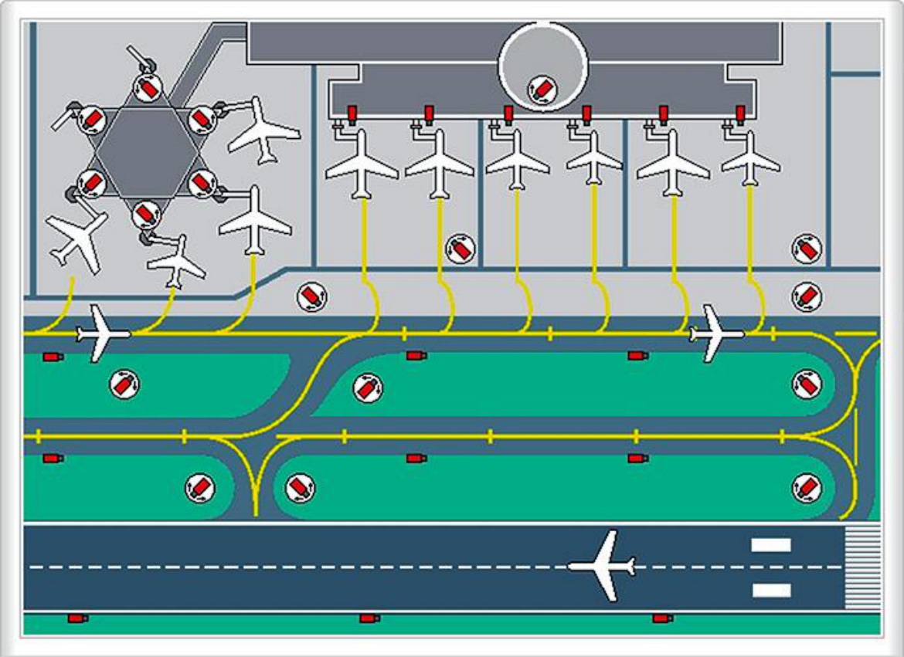

*Рисунок 1.1 – Пример установки камер в аэропортах*

Однако несмотря на текущий уровень функциональности, существует необходимость постоянного улучшения данной структуры для более эффективного обнаружения и реагирования на потенциальные угрозы. Современные технологии, такие как детектирование, распознавание и трекинг, предоставляют новые возможности для улучшения системы видеонаблюдения в аэропортах. Возникающие угрозы становятся все более изощренными, требуя более высокой степени автоматизации и точности в обнаружении и идентификации подозрительных действий или объектов. Введение современных технологий, таких как алгоритмы машинного обучения для распознавания лиц и объектов, а также системы трекинга для отслеживания движущихся объектов, позволит значительно улучшить способность системы видеонаблюдения реагировать на потенциальные угрозы. Это позволит операторам системы быстрее и точнее реагировать на инциденты и своевременно предпринимать соответствующие меры по обеспечению безопасности.

### 1.3 Решаемые задачи обработки видеоданных

В процессе обеспечения безопасности и контроля охраняемых зон аэропорта важными компонентами являются детектирование, распознавание и трекинг объектов. Данные задачи позволяют не только выявлять и идентифицировать движущиеся объекты, но и отслеживать их перемещения, что является ключевым для предотвращения несанкционированного доступа и других нарушений. Рассмотрим данные задачи более подробно. Детектирование объектов является первым шагом в системе видеонаблюдения. Оно включает в себя процесс обнаружения движущихся объектов в видео потоке. Система должна быть способна эффективно отличать движущиеся объекты от статического фона, что достигается с помощью методов обработки изображений и машинного обучения. Важность детектирования заключается в способности системы выявлять потенциальные угрозы или интересующие объекты в режиме реального времени, что позволяет оперативно реагировать на различные инциденты. После того как объекты были обнаружены, следующим шагом является их распознавание. Распознавание объектов включает в себя идентификацию и классификацию обнаруженных объектов на основе их характеристик. В контексте аэропортов это может включать распознавание людей, багажа, транспортных средств и других объектов. Точные алгоритмы распознавания позволяют не только идентифицировать тип объекта, но и, при необходимости, проводить дальнейшую проверку, например, лицевую идентификацию пассажиров. Трекинг объектов завершает процесс, обеспечивая непрерывное отслеживание перемещений обнаруженных и распознанных объектов в пространстве. Трекинг позволяет системе фиксировать траектории движения объектов, что особенно важно для анализа поведения и обнаружения подозрительной активности. Использование алгоритмов трекинга, таких как фильтр Калмана, позволяет предсказывать позиции объектов в последующих кадрах, улучшая стабильность и точность системы видеонаблюдения.

Данные три задачи – детектирование, распознавание и трекинг — являются фундаментальными компонентами эффективной системы видеонаблюдения. Совместное использование данных технологий обеспечивает высокий уровень безопасности и контроля в охраняемых зонах аэропорта, позволяя своевременно реагировать на потенциальные угрозы и предотвращать инциденты.

## 2 Обнаружение проникновения в охраняемую зону

### 2.1 Основы детектирования объектов

Детектирование объектов на изображениях и видео является ключевым этапом в обработке компьютерного зрения. Оно заключается в автоматическом обнаружении присутствия объектов определенного класса или категории на изображениях или кадрах видео. Ниже представлен обзор основных методов детектирования объектов:

- Подходы на основе хаар-каскадов (Haar Cascades): Данный метод основан на использовании признаков Хаара, которые представляют собой оконные функции, используемые для выявления особенностей изображений. Алгоритм работает путем сканирования изображения с помощью окон различного размера и формы для поиска соответствующих признаков. Хотя данный метод может быть эффективным для некоторых классов объектов, он обычно требует тщательной настройки параметров для достижения высокой точности детектирования.

- Методы на основе сверточных нейронных сетей (Convolutional Neural Networks, CNN): Современные методы детектирования объектов широко используют глубокие нейронные сети, такие как SSD (Single Shot Multibox Detector), YOLO (You Only Look Once) и Faster R-CNN (Region-based Convolutional Neural Networks). Данные методы представляют собой единую архитектуру, которая способна одновременно предсказывать границы ограничивающих рамок и классы объектов в кадре видео. Они демонстрируют высокую скорость работы и точность детектирования, что делает их предпочтительными для широкого спектра приложений, включая безопасность в аэропортах.

- Методы на основе гистограмм ориентированных градиентов (Histogram of Oriented Gradients, HOG): Данный метод основан на извлечении локальных текстурных и градиентных особенностей из

изображения и последующем использовании данных особенностей для обнаружения объектов. Хотя метод HOG был популярен ранее, с развитием глубокого обучения его применение в детектировании объектов уступило место более современным подходам. Выбор конкретного метода детектирования объектов зависит от требований конкретной задачи, таких как требуемая скорость работы, точность детектирования, а также доступные ресурсы вычислительной мощности. Для задач безопасности в аэропортах, где необходимо быстро и точно обнаруживать объекты на видео, методы на основе сверточных нейронных сетей часто являются наиболее эффективными. Они позволяют обнаруживать объекты в реальном времени и обеспечивают высокую точность детектирования при минимальных ограничениях по

### 2.2 Алгоритм детектирования

В контексте дипломной работы, ориентированной на обнаружение движущихся объектов, необходимо стремиться к созданию идеального выходного файла, содержащего видеокадры с правильными обнаружениями. Данный подход предполагает разработку конвейера алгоритма, который позволит достичь поставленной цели (см. рисунок 2.1).

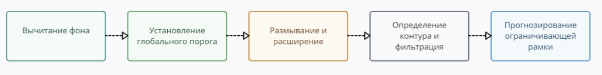

*Рисунок 2.1 – Этапы алгоритма детектирования*

Алгоритм обнаружения движущихся объектов состоит из нескольких этапов, таких как вычитание фона, установка глобального порога, размытие и расширение, определение контуров, фильтрация и прогнозирование ограничивающих рамок. Рассмотрим каждый из данных шагов более подробно.

#### 2.2.1 Вычитание фона

Первый этап в процессе обнаружения движущихся объектов – вычитание фона. Для этого используется статическая камера, что является

распространенным и широко применяемым методом для формирования маски переднего плана. Данная маска представляет собой двоичное изображение, на котором отображены пиксели, принадлежащие движущимся объектам в сцене. Фрагмент кода программы с вычитания фона представлен на рисунке 2.2.

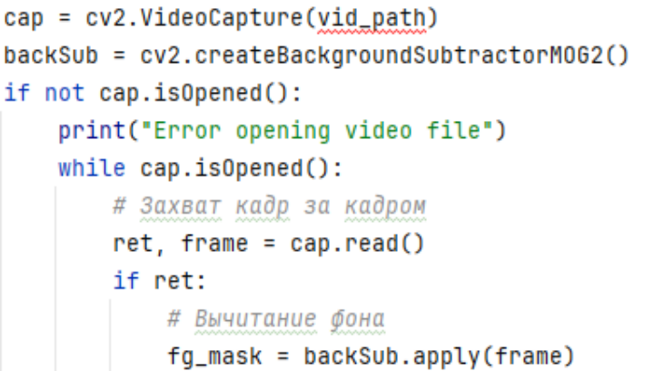

*Рисунок 2.2 – Реализация вычитания фона*

Пример записи видеонаблюдения представлен на рисунке 2.3.

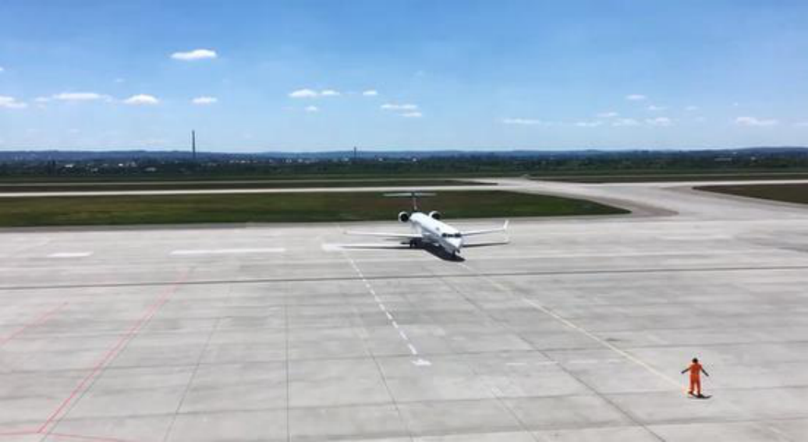

*Рисунок 2.3 – Пример записи видеонаблюдения*

Функция вычитания фона вычисляет маску переднего плана путем выполнения операции вычитания между текущим кадром и фоновой моделью, которая содержит статическую часть сцены или все, что можно рассматривать как фон с учетом характеристик сцены. Процесс фонового моделирования включает в себя два основных этапа: инициализацию фона и его обновление.

На первом этапе определяется исходная модель фона, в то время как на втором этапе эта модель обновляется, чтобы адаптироваться к возможным изменениям в сцене.

#### 2.2.2 Обнаружение контуров

Контуры представляют собой кривые, соединяющие все непрерывные точки с одинаковым цветом или интенсивностью вдоль границы изображения. Они широко используются для анализа формы объектов, их обнаружения и распознавания. OpenCV предоставляет удобные средства для поиска и отображения контуров на изображениях с использованием функций findContours и drawContours. Данные функции предлагают два варианта алгоритмов для определения контуров: CHAIN_APPROX_SIMPLE и CHAIN_APPROX_NONE. Каждый из них имеет свои особенности и может быть выбран в зависимости от конкретных требований приложения. В результате анализа видеоданных выявляются все движущиеся пиксели между последовательными кадрами. Данные пиксели включают в себя различные объекты, такие как автомобили, тени и маленькие белые точки. При анализе реальных сценариев различные аспекты окружающей среды могут оказывать влияние на запись видео с камер видеонаблюдения. Данные факторы включают погодные условия, такие как сильный ветер, который может вызывать дрожание камеры или движение объектов, создавая ложные срабатывания датчика движения (см. рисунок 2.4).

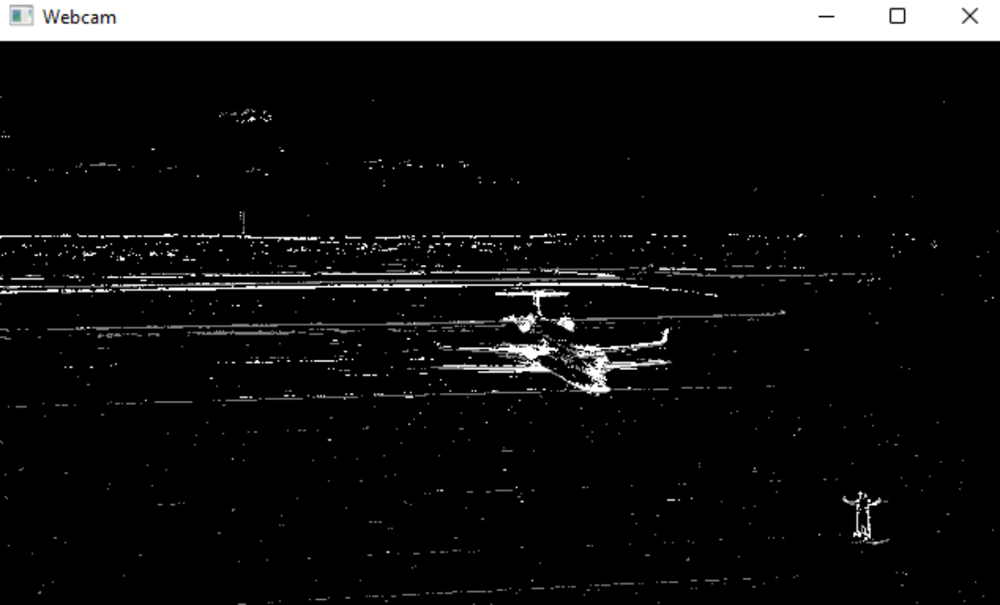

*Рисунок 2.4 – Пример вычитания фона*

#### 2.2.3 Рисования контуров

После вычитания фона у нас теперь есть четкая двоичная маска нашей ROI (области интереса). Итак, мы перейдем к обнаружению контура. Приведенный ниже на рисунок 2.5 блок кода описывает процесс.

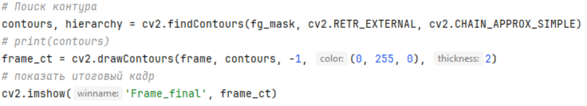

*Рисунок 2.5 – Реализация поиска контура*

Для этого мы должны передать маску переднего плана (fg_mask) в качестве входных данных в cv2.findContours функции, чтобы найти все возможные точки контура. Это произойдет для всех обнаруженных объектов в текущем кадре. После этого мы передадим все точки контура в cv2.drawContours функцию для рисования контуров для каждого обнаруженного контура.

При рисовании всех контуров становится заметным наличие множества лишних элементов. Данные мелкие, зашумленные контуры могут негативно сказаться на конечных результатах (см. рисунок 2.6).

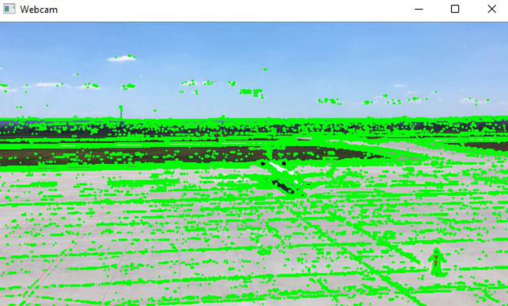

*Рисунок 2.6 – Пример наложения маски контуров*

#### 2.2.4 Улучшение обнаружения контуров

Появление зашумленных контуров обусловлено движением теней и камеры. Необходимо удалить все помехи, чтобы получить четкий кадр с обнаруженным контуром нашего ROI (автомобиля). Для решения данной проблемы мы выполняем 3 различных шага:

1. Установка порогового значения.

2. Применение операций эрозии и расширения.

3. Фильтрация контуров. Для определения порога используется функция cv2.threshold, к которой передаются все маски переднего плана в качестве входных данных. Устанавливается пороговое значение на уровне 180, а максимальное значение – на 255. Это приводит к замене всех значений ниже 180 на 0 и удалению всех теней (см. рисунок 2.7).

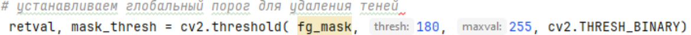

*Рисунок 2.7 – Установка глобального порога*

Результат операции определения порога демонстрируется на полученном изображении (см. рисунок 2.8).

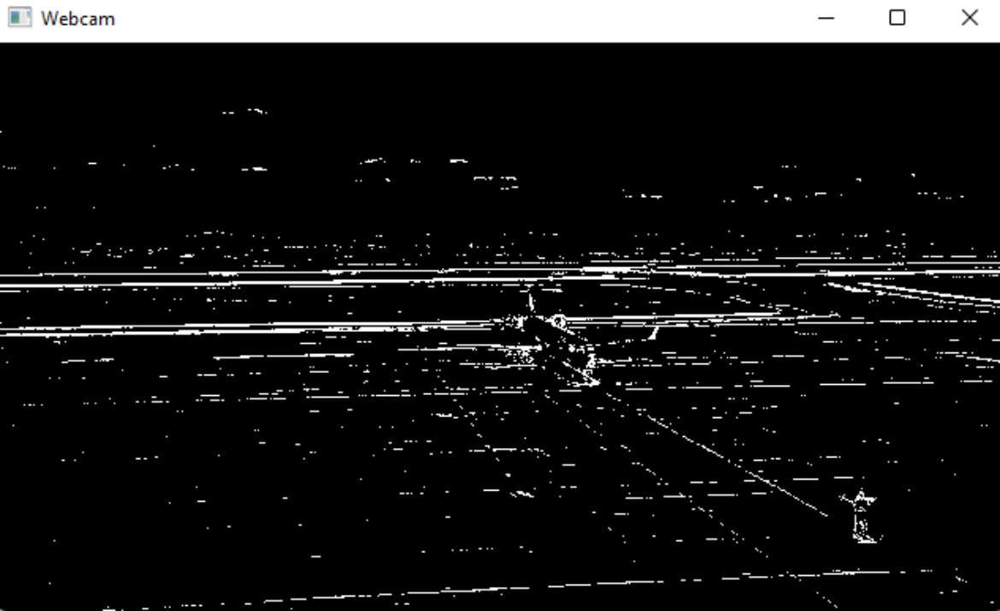

*Рисунок 2.8 – Пример улучшения обнаружения контуров*

После применения порогового значения у нас формируется маска бинарного изображения, представляющая собой маску переднего плана без теней. Однако в маске остаются маленькие белые точки. Следующим шагом будет удаление контуров вокруг данных маленьких точек. Для удаления маленьких белых точек применяется операция эрозии, после чего изображение расширяется для получения лучшей и более широкой маски. Для этого используется функция cv2.morphologyEx с параметром cv2.MORPH_OPEN в качестве типа морфологической операции (см. рисунок 2.9).

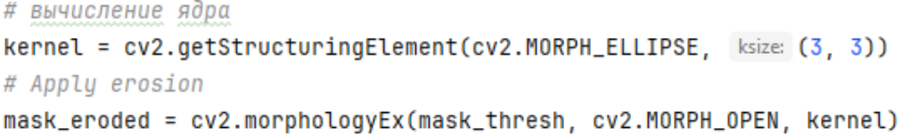

*Рисунок 2.9 – Реализация удаления контуров*

В эту операцию передается маска с пороговым значением mask_thresh. Результаты обеих операций проверяются. Теперь мы получаем более чистое изображение (см. рисунок 2.10). Остальную очистку можно выполнить, отфильтровав контуры небольших участков.

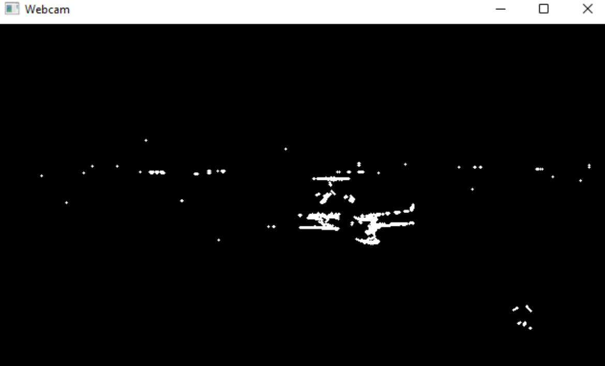

*Рисунок 2.10 – Пример операции эрозии*

Фильтрация контуров иногда требует применения метода проб и ошибок. Было установлено, что для нашего конкретного случая наилучшим вариантом является использование контура, площадь которого составляет 500 пикселей. В следующем блоке кода производится фильтрация всех контуров, размер которых менее 500 пикселей (см. рисунок 2.11). Данный подход позволяет сохранить наиболее заметные объекты (см. рисунок 2.12).

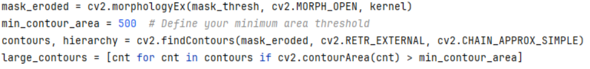

*Рисунок 2.11 – Реализация фильтрации контуров*

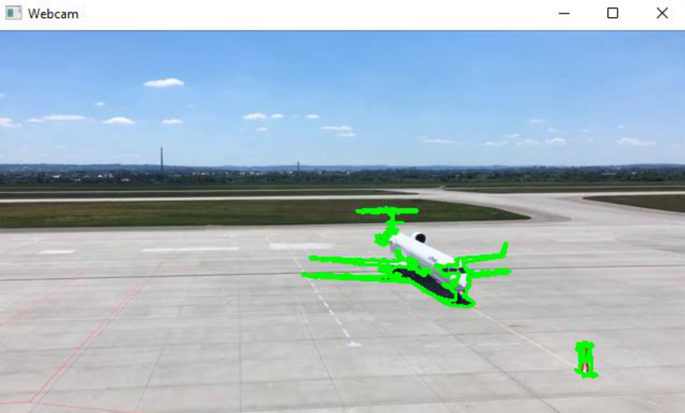

*Рисунок 2.12 – Пример фильтрации контуров*

Следующим этапом в процессе обнаружения движущихся объектов является рисование ограничивающих рамок вокруг оставшихся контуров. Здесь и происходит фактическое обнаружение объектов. Сначала извлекаются координаты прямоугольника с помощью функции cv2.boundingRect. Затем для каждого видеокадра рисуются ограничивающие рамки для всех обнаруженных объектов с помощью функции cv2.rectangle (см. рисунок 2.13).

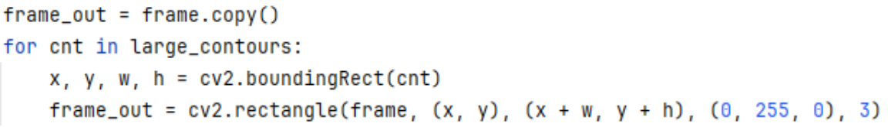

*Рисунок 2.13 – Реализация рисовании ограничивающих рамок*

Результат операции рисовании ограничивающих рамок демонстрируется на полученном изображении (см. рисунок 2.14).

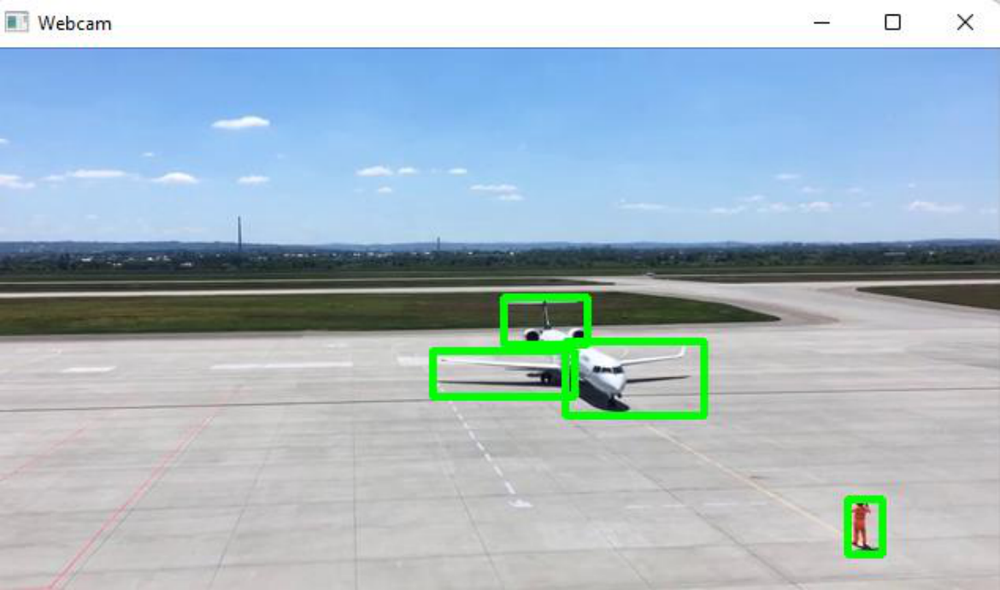

*Рисунок 2.14 – Пример детектирования движущихся объектов*

## 3 РАСПОЗНАВАНИЕ ДВИЖУЩИХСЯ ОБЪЕКТОВ

### 3.1 Выбор метода распознавания

Для обнаружения и трекинга движущихся объектов в охраняемых зонах аэропортов, в том числе в ангарах с самолетами, эффективным решением является применение алгоритмов компьютерного зрения. Одним из наиболее эффективных и широко применяемых методов обнаружения объектов на видео является YOLO (You Only Look Once). Преимущества YOLO перед другими методами обнаружения объектов включают в себя:

1. Высокая скорость работы. YOLO способен обрабатывать видеопоток в реальном времени благодаря своей способности вычислять расположение и класс объекта в единой операции. Это делает его идеальным выбором для систем мониторинга, где требуется оперативная реакция на изменения ситуации.

2. Точность детекции. YOLO демонстрирует высокую точность обнаружения объектов на видео благодаря использованию единой модели для предсказания расположения и класса объекта. Это позволяет избежать проблем, связанных с объединением результатов от различных моделей или этапов обработки.

3. Устойчивость к изменениям масштаба. Алгоритм YOLO способен обнаруживать объекты различного размера и формы без необходимости многократного сканирования изображения с разными масштабами.

4. Минимальное количество ложных срабатываний. Благодаря своей архитектуре YOLO уменьшает количество ложных срабатываний, что особенно важно для систем безопасности, где каждое ложное срабатывание может привести к неправомерной тревоге или потере ресурсов.

5. Простота использования и интеграции. YOLO предоставляет открытый и простой в использовании API, что облегчает его

интеграцию с другими системами безопасности, такими как системы видеонаблюдения в аэропортах. Выбор YOLO для детектирования и трекинга движущихся объектов в аэропортах обусловлен его высокой производительностью, точностью и устойчивостью к различным условиям эксплуатации. Данные характеристики делают его оптимальным решением для обеспечения безопасности оборудования и жизней людей в охраняемых зонах аэропортов.

### 3.2 Обзор нейронной сети YOLO

YOLO (You Only Look Once) – одна из самых популярных архитектур для обнаружения объектов в реальном времени. Её особенность заключается в том, что она представляет собой единую нейронную сеть, которая способна предсказывать границы рамок и классы объектов в данных рамках одновременно. Это делает YOLO очень эффективной и быстрой для обработки видеопотоков. Вот основные шаги по использованию YOLO для обнаружения объектов с использованием OpenCV:

- Загрузка модели YOLO. Сначала необходимо загрузить предварительно обученную модель YOLO. Это можно сделать путем загрузки весов и конфигурационного файла. Кроме того, потребуется файл с метаданными, содержащий названия классов.

- Подготовка изображения. Изображение, на котором вы хотите обнаружить объекты, должно быть предварительно обработано. Это может включать изменение размера, нормализацию и преобразование в формат, который ожидает модель YOLO.

- Прямой проход через сеть. После подготовки изображение подается на вход нейронной сети YOLO для выполнения обнаружения объектов. Это приведет к получению рамок с обнаруженными объектами и их вероятностями принадлежности к классам.

- Отображение результатов. После получения результатов обнаружения объектов и их классов их можно отобразить на

изображении с помощью OpenCV. Это обычно включает отрисовку ограничивающих рамок вокруг объектов и вывод текста с классом и уверенностью модели.

- Отображение и сохранение. Наконец, отображение обработанного изображения с результатами обнаружения объектов и, если необходимо, сохранение его в файл для дальнейшего использования. Архитектура YOLO имеет сходство с другими методами обнаружения объектов на изображениях в том, что на начальных этапах процесса входное изображение подается на вход сверточной нейронной сети (CNN). В YOLO используется специальная CNN под названием Darknet-53. Далее полученные карты признаков анализируются специальным образом, чтобы определить положение и размеры ограничивающих рамок (bounding boxes) и классы объектов, которым они принадлежат. Разница между двухуровненвыми архитектурами и архитектурой YOLO продемонстрирована на рисунок 3.1.

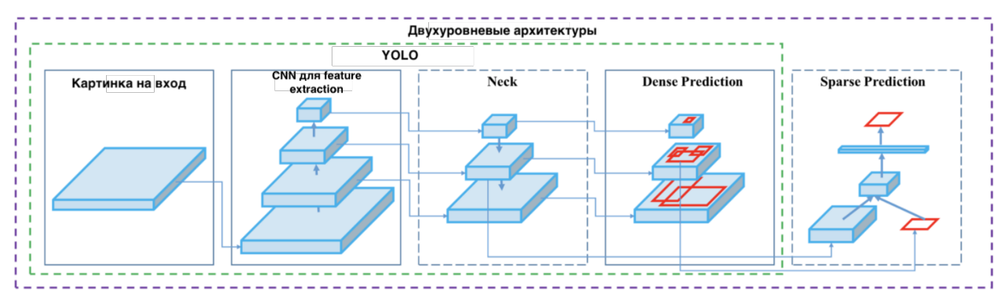

*Рисунок 3.1 – Архитектура YOLO*

Метод Sparse Prediction повторяет основные принципы двухуровневых алгоритмов, где объекты сначала идентифицируются в отдельных областях, а затем классифицируются данные области. Блок Neck (или «шея») представляет собой дополнительный компонент, спроектированный для интеграции информации от предыдущих слоев и повышения точности предсказаний. Для более подробного понимания этого аспекта можно обратиться к таким терминам, как «Path Aggregation Network», «Spatial Attention Module» и «Spatial Pyramid Pooling».

Однако ключевым отличием YOLO от других архитектур является блок Dense Prediction. Данный блок является краеугольным камнем YOLO и именно он позволяет алгоритму достичь лидерства в эффективности обнаружения объектов. Философия YOLO (You Only Look Once) заключается в том, что алгоритм проводит анализ изображения всего один раз через нейронную сеть, чтобы выполнить все необходимые шаги по обнаружению объектов.

### 3.3 Обучение нейронной сети и используемый датасет

Для повышения точности распознавания объектов необходимо обучить нейронную сеть. В качестве моделей для обучения используются изображения и видеозаписи, полученные с камер наблюдения, установленных в охраняемых зонах аэропорта. Обучение нейронной сети включает следующие этапы:

1. Необходимо собрать значительный объем данных, представляющих собой изображения и видеозаписи с различными типами объектов, присутствующих в охраняемых зонах аэропорта. Эти данные должны включать как типичные, так и редкие сценарии, чтобы нейронная сеть могла эффективно распознавать объекты в любых условиях.

2. После сбора данных необходимо разметить их, то есть определить границы и классы объектов на каждом изображении или видеокадре. Данная разметка служит эталоном для обучения нейронной сети.

3. Размеченные данные необходимо преобразовать в формат, подходящий для обучения нейронной сети YOLO. Это включает нормализацию изображений, изменение их размера и разделение на обучающую и тестовую выборки.

4. Обучение модели YOLO проводится с использованием подготовленного датасета. В процессе обучения сеть корректирует свои параметры, чтобы минимизировать ошибку распознавания объектов на изображениях.

5. После обучения модель тестируется на отложенной тестовой выборке для оценки её производительности. Данный этап позволяет выявить и устранить возможные ошибки и недочеты в работе модели. Для успешного обучения и последующего использования нейронной сети YOLOv8, необходим тщательно подготовленный датасет, который включает в себя изображения с соответствующими аннотациями. В рамках данного проекта был разработан датасет под названием "Small Detection", включающий более 3000 изображений беспилотников и птиц, заснятых на дальнем расстоянии. Датасет "Small Detection" состоит из изображений размером 640x640 пикселей. Все изображения содержат объекты двух категорий: беспилотники и птицы. Основной целью датасета является предоставление данных для обучения модели YOLOv8, которая сможет эффективно обнаруживать и классифицировать эти объекты, несмотря на их небольшой размер и значительное расстояние до камеры. Каждое изображение в датасете сопровождается аннотациями, которые следуют следующей структуре:

- класс объекта;

- x координата;

- y координата;

- ширина объекта;

- высота объекта. Эти аннотации записываются в текстовом формате, где каждая строка представляет собой описание одного объекта на изображении. Все изображения были собраны с помощью различных камер и датчиков, установленных на беспилотные летательные аппараты и стационарные точки наблюдения. После сбора, изображения были стандартизированы до размера 640x640 пикселей для обеспечения консистентности данных и совместимости с архитектурой YOLOv8.

Датасет "Small Detection" используется для обучения нейронной сети YOLOv8 в целях улучшения её способности обнаруживать мелкие объекты на значительном расстоянии. С помощью этого датасета модель обучается распознавать специфические особенности и паттерны, характерные для беспилотников и птиц, что позволяет добиться высокой точности и скорости детекции в реальных условиях. Таким образом, "Small Detection" является ключевым компонентом для обучения и тестирования модели YOLOv8, способствующим повышению её эффективности в задачах обнаружения мелких объектов на больших расстояниях.

### 3.4 Подключение обученной модели

Для инициирования вывода на видео, применяется обученная модель. Реализация подключения обученной модели приведен на рисунок 3.2.

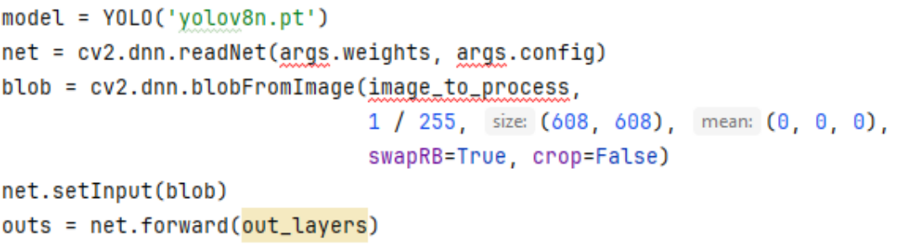

*Рисунок 3.2 – Реализация вывода на видео*

Функцией cv2.dnn.readNet можно сгенерировать разные цвета для разных классов, чтобы нарисовать ограничительные рамки. С видеопотока считывается кадр и подается аргументом в функцию cv2.dnn.blobFromImage, которая подготавливают входное изображение к прогону через глубокую нейронную сеть. Функция net.forward(out_layers) выполняет передачу входных данных через нейронную сеть для получения выходных данных. Параметр out_layers представляет список имен выходных слоев, которые необходимо получить из модели. После выполнения данной функции получаются выходные данные для указанных слоев, которые затем могут быть обработаны для обнаружения объектов на изображении.

Функция cv2.dnn.NMSBoxes(boxes, class_scores, 0.0, 0.4) в OpenCV применяет алгоритм Non-Maximum Suppression (NMS) к результатам детектирования объектов (см. рисунок 3.3).

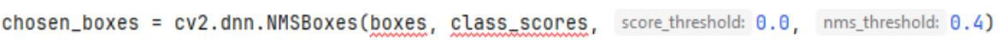

*Рисунок 3.3 - Реализация chosen_boxes*

Данный алгоритм используется для фильтрации дублирующихся детекций и оставления только наиболее значимых объектов. Параметры:

1. boxes - cписок ограничивающих рамок (bounding boxes) объектов.

2. class_scores - cписок оценок уверенности (confidence scores) для каждого класса объектов.

3. score_threshold - порог оценки уверенности. Обнаруженные объекты с оценкой уверенности ниже этого порога будут отброшены.

4. nms_threshold - порог для алгоритма NMS. Данный порог определяет, насколько близко должны быть объекты друг к другу, чтобы считаться дубликатами. Таким образом, после применения cv2.dnn.NMSBoxes, получается отфильтрованный список объектов с их оценками уверенности, где дублирующиеся детекции удалены в соответствии с порогами score_threshold и nms_threshold. Следующими шагами являются прорисовка контуров и вывод количества обнаруженных объектов, за что отвечают пользователькие функции draw_object_bounding_box и draw_object_count соответственно.

### 3.4 Результаты

Для тестирования обученной модели в терминал вводится путь к видеофайлу с примером проникновения и имя объекта распознавания (см. рисунок 3.4).

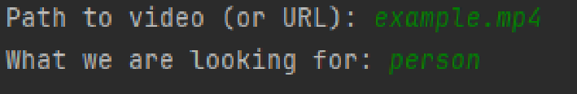

*Рисунок 3.4 – Пример ввода пути файла и объект распознавания*

Результат работы приложения приведен на рисунке 3.5.

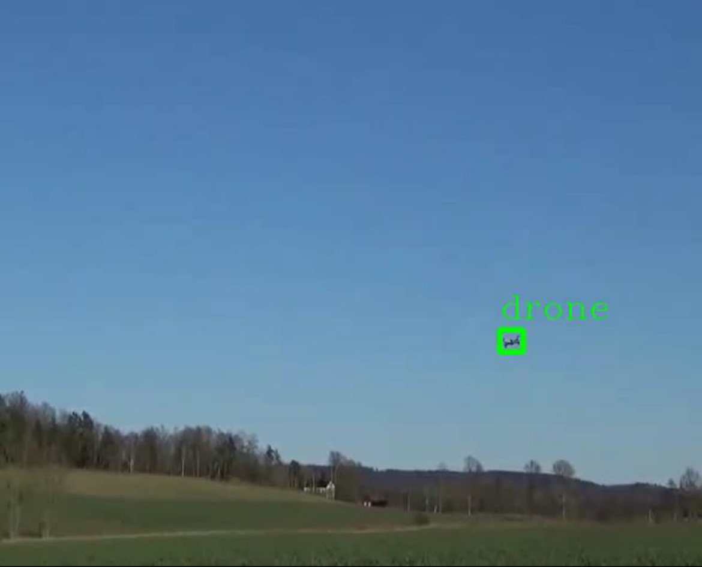

*Рисунок 3.5 – Пример распознавания объекта*

## 4 ТРЕКИНГ ОБЪЕКТОВ НАБЛЮДЕНИЯ

Для трекинга объектов после их детектирования используется комбинация алгоритмов YOLO и OpenCV. YOLO обеспечивает высокоточную детекцию объектов на изображении или видео, а для отслеживания объектов в последующих кадрах применяются алгоритмы трекинга, такие как алгоритм Кальмана или оптимальная фильтрация данных. Данные алгоритмы позволяют прогнозировать новое положение объекта на основе предыдущих измерений и корректировать его позицию с учетом новых данных.

### 4.1 Метод трекинга DeepSORT

Для обеспечения надежного трекинга объектов, обнаруженных с помощью нейронной сети YOLOv8, был выбран метод трекинга DeepSORT (Simple Online and Realtime Tracking with a Deep Association Metric). DeepSORT является улучшенной версией алгоритма SORT, добавляющей мощные механизмы ассоциации объектов на основе глубоких нейронных сетей, что значительно повышает точность и устойчивость трекинга в сложных условиях. Существует множество методов трекинга объектов, каждый из которых имеет свои преимущества и недостатки. Среди них можно выделить:

1. Kalman Filter. Один из наиболее простых и быстрых методов для предсказания положения объектов, однако, он плохо справляется с объектами, имеющими сложные и непредсказуемые траектории.

2. SORT (Simple Online and Realtime Tracking). Этот метод использует Kalman Filter для предсказания положения объектов и венгерский алгоритм для ассоциации детекций с треками. Он отличается высокой скоростью и простотой, но может терять объекты в случае их временного перекрытия или быстрых изменений в движении.

3. Tracktor. Метод, использующий выходы детекторов объектов непосредственно для трекинга. Хотя он обладает хорошей точностью, его производительность сильно зависит от качества детекции.

4. FairMOT. Комбинирует задачи детекции и трекинга в единую модель, что позволяет достичь высокой точности. Однако, такой подход может быть вычислительно затратным и сложным в настройке. Метод DeepSORT был выбран для данного проекта по нескольким причинам:

1. Высокая точность ассоциации. В отличие от базового SORT, DeepSORT использует дополнительные признаки объектов, извлекаемые глубокой нейронной сетью. Это позволяет лучше различать и отслеживать объекты, даже если их траектории пересекаются или они временно пропадают из поля зрения.

2. Устойчивость к перекрытиям. Благодаря использованию глубоких признаков, метод более устойчив к ситуациям, когда объекты частично или полностью перекрывают друг друга, что часто случается в реальных условиях.

3. Гибкость и адаптивность. DeepSORT можно адаптировать к различным типам объектов и сценам, просто обучив его на соответствующих данных.

4. Реальное время. Несмотря на дополнительную вычислительную нагрузку, связанная с извлечением признаков, DeepSORT способен работать в реальном времени, что критично для многих практических приложений. После обработки изображений с помощью модели YOLOv8, которая выполняет детекцию объектов, выходные данные (bounding boxes) передаются на вход алгоритму DeepSORT. Процесс состоит из нескольких этапов:

1. Извлечение признаков объектов. На основании координат bounding boxes, DeepSORT извлекает признаки объектов с помощью предварительно обученной нейронной сети. Эти признаки помогают лучше различать объекты друг от друга.

2. Прогнозирование и ассоциация. Используя Kalman Filter, DeepSORT предсказывает положение объектов на следующем кадре. Затем

венгерский алгоритм ассоциирует новые детекции с существующими треками, опираясь как на геометрическую близость, так и на схожесть признаков.

3. Обновление треков. Треки обновляются на основе новых данных, и для них пересчитываются параметры Kalman Filter.

4. Инициализация и удаление треков. Новые треки инициализируются для объектов, которые не удалось ассоциировать с существующими треками, а старые треки удаляются, если объект не был обнаружен на протяжении нескольких кадров. Таким образом, DeepSORT обеспечивает надежный и точный трекинг объектов, обнаруженных моделью YOLOv8, позволяя эффективно отслеживать их движение в реальном времени.

### 4.2 Реализация алгоритма трекинга

В рамках реализации трекера SORT (Simple Online and Realtime Tracking) используется класс KalmanBoxTracker. Данный класс реализует фильтр Калмана для отслеживания объектов в видео (см. рисунок 5.1).

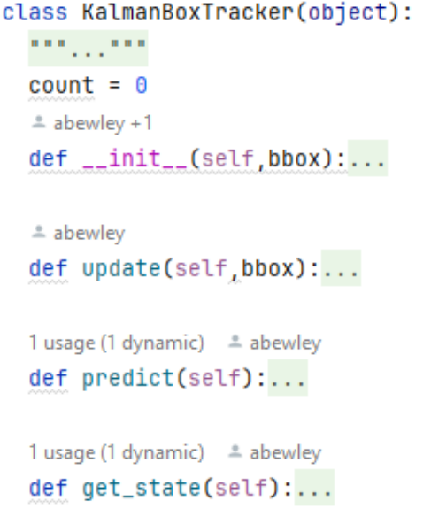

*Рисунок 5.1 – Реализация класса KalmanBoxTracker*

Класс KalmanBoxTracker содержит следующие основные методы:

- Инициализация: задаются начальные значения состояния и ковариации ошибки, а также создаются необходимые матрицы F, H, Q, R (см. рисунок 5.2).

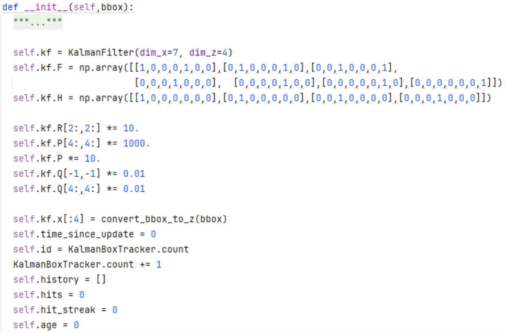

*Рисунок 5.2 – Инициализация класса KalmanBoxTracker*

- Предсказание: выполняется обновление состояния и ковариации ошибки на основе моделей системы и измерений (см. рисунок 5.3).

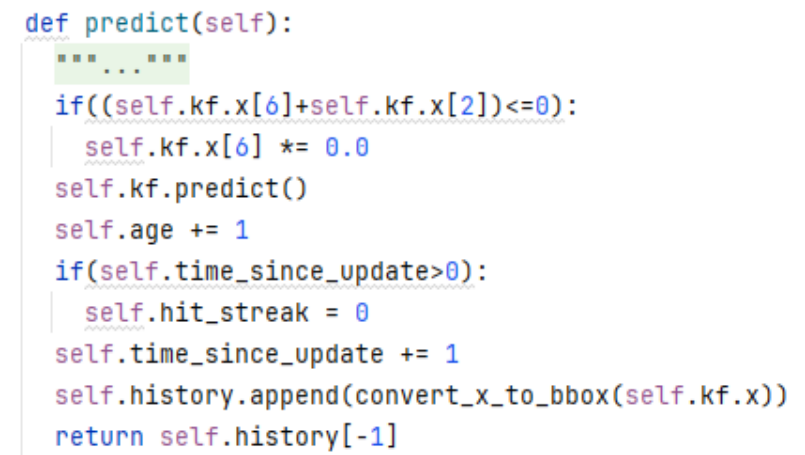

*Рисунок 5.3 – Функция предсказания класса KalmanBoxTracker*

- Обновление: корректируются предсказанные значения состояния и ковариации ошибки с учетом новых данных измерений (см. рисунок 5.4).

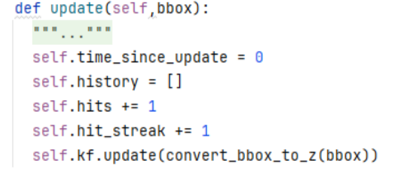

*Рисунок 5.4 – Метод обновления класса KalmanBoxTracker*

Класс Sort управляет множеством экземпляров KalmanBoxTracker, отвечая за их инициализацию, обновление и удаление (см. рисунок 5.5).

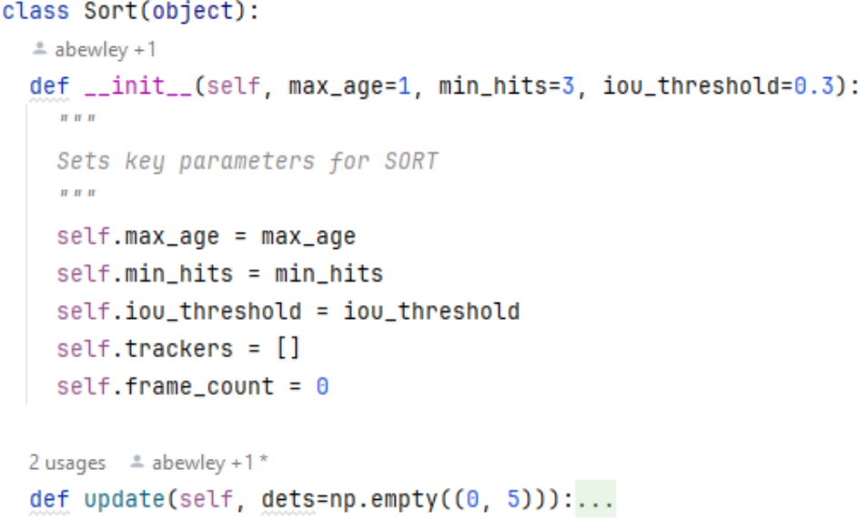

*Рисунок 5.5 – Реализация класса Sort*

Данный класс выполняет следующие функции (см. рисунок 5.6):

- Обновление треков. Принимает новые детекции, сопоставляет их с существующими треками и обновляет состояние трекеров.

- Создание новых треков. При обнаружении новых объектов инициализируются новые экземпляры KalmanBoxTracker.

- Удаление старых треков. Удаляются треки, которые не обновлялись в течение определенного количества кадров.

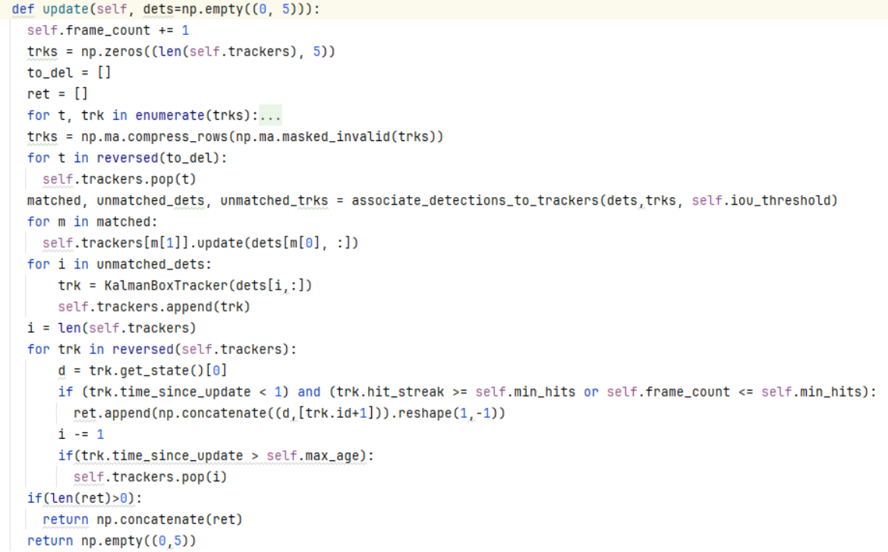

*Рисунок 5.6 – Метод для обновления, создания и удаления треков*

класса Sort

### 4.3 Сохранение записей обнаружений в базу данных

Эффективное отслеживание объектов в видео включает не только процесс детекции и трекинга, но и сохранение результатов для последующего анализа. Сохранение данных обнаружений в базу данных позволяет организовать систематическое хранение, доступ и обработку информации. В данной главе рассматривается методология и реализация сохранения координат обнаруженных объектов в базу данных PostgreSQL. Использование базы данных PostgreSQL обусловлено ее высокой производительностью, надежностью и поддержкой стандарта SQL. Для хранения данных об объектах создается специальная таблица, структура которой определяется следующим образом (см. рисунок 5.7):

- obj_id – идентификатор объекта;

- frame – номер кадра, на котором был обнаружен объект;

- x – координата центра объекта по оси X;

- y – координата центра объекта по оси Y.

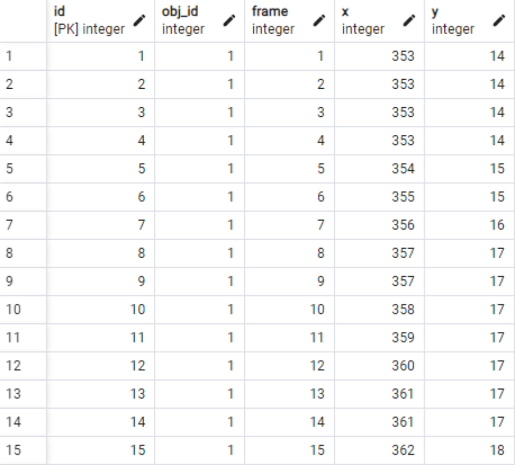

*Рисунок 5.7 – Пример записей обнаружений в базе данных*

Подключение к базе данных PostgreSQL выполняется с использованием библиотеки psycopg2. Для установления соединения необходимо указать параметры подключения, такие как имя базы данных, пользователь, пароль, хост и порт. В случае успешного подключения создается объект соединения, который используется для выполнения запросов к базе данных. Для сохранения координат обнаруженных объектов используется функция, выполняющая вставку данных в таблицу. Функция принимает параметры: идентификатор объекта, номер кадра, координаты x и y. Для выполнения SQL-запроса используется курсор, создаваемый из объекта соединения. После выполнения запроса изменения фиксируются с помощью метода `commit`. В процессе обработки видеопотока производится детекция объектов на каждом кадре. Детекции преобразуются в формат, подходящий для трекера. Трекер обновляет состояние объектов, и для каждого объекта вычисляются координаты центра. Данные координаты сохраняются в базу данных с использованием функции вставки.

Сохранение данных об обнаруженных объектах в базе данных обеспечивает возможность последующего анализа и использования информации. Реализованный метод позволяет эффективно организовать процесс сохранения данных в реальном времени, поддерживая интеграцию с системами обработки видеопотоков и трекинга объектов. База данных PostgreSQL, используемая для хранения, предоставляет надежные механизмы для управления данными и выполнения запросов.

### 4.4 Уведомление операторам об обнаружении

Модуль сигнализации реализует функцию, которая отображает окно уведомления на экране оператора при обнаружении целевого объекта. Для этого используется библиотека OpenCV. Реализация уведомления об обнаружении движущегося объекта приведена на рисуноке 5.8.

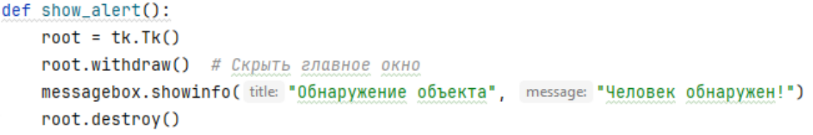

*Рисунок 5.8 – Реализация уведомления об обнаружении*

Реализация системы сигнализации и уведомления операторов позволяет оперативно реагировать на появление целевых объектов в зоне наблюдения. Введение дополнительного модуля, ответственного за генерацию и отображение уведомлений, значительно повышает эффективность мониторинга и обеспечивает своевременное информирование операторов о важных событиях. Данная система может быть интегрирована в различные приложения видеонаблюдения, обеспечивая надежную и непрерывную работу в режиме реального времени. Пример для уведомления операторам об обнаружения человека в кадре продемонстрирован на рисуноке 5.9.

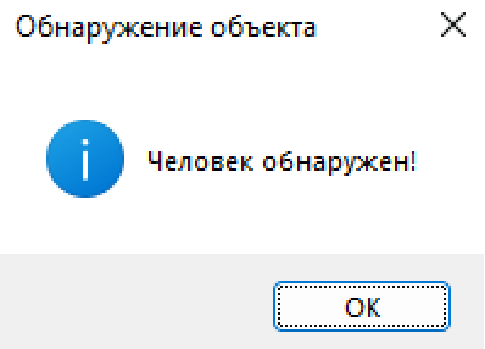

*Рисунок 5.9 – Пример уведомления*

Уведомление показывается для одного объекта только один раз благодаря использованию множества detected_objects. Множество служит для хранения идентификаторов обнаруженных объектов. Логика работы кода следующая:

- В начале основного цикла, где производится обработка каждого кадра видео, инициализируется пустое множество detected_objects. Оно будет использоваться для хранения уникальных идентификаторов обнаруженных объектов.

- Для каждого отслеживаемого объекта проверяется, находится ли его идентификатор obj_id в множестве detected_objects.

- Если obj_id не найден в множестве, это означает, что объект обнаружен впервые. В этом случае идентификатор объекта добавляется в множество detected_objects, и вызывается функция show_alert, которая показывает уведомление об обнаружении объекта. Это гарантирует, что уведомление показывается только один раз для каждого уникального объекта, поскольку после первого показа его идентификатор добавляется в множество detected_objects, и последующие проверки для этого объекта будут всегда возвращать True, предотвращая повторное отображение уведомления.

### 4.5 Результаты

Сочетание быстрой и точной детекции объектов с последующим трекингом позволяет эффективно отслеживать объекты на

видеоизображениях. Графический вывод результатов и сохранение записей обнаружений в базу данных делают процесс анализа и визуализации полученных данных более удобным и информативным. Результаты работы метода трекинга, где объекты перемещается в кадре, приведены на рисунке 5.10.

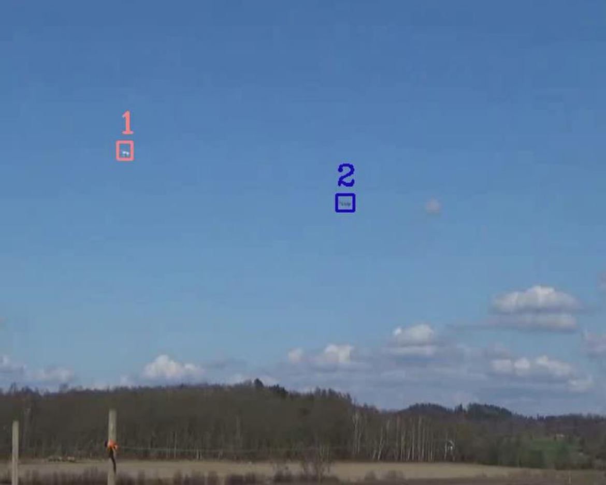

*Рисунок 5.10 – Пример с трекингом объекта 1*

## ЗАКЛЮЧЕНИЕ

В рамках выпускной квалификационной работы рассмотрены вопросы построения систем видеонаблюдения для охраняемых зон аэропорта с применением современных технологий компьютерного зрения и машинного обучения. Основное внимание уделено алгоритмам детектирования, распознавания и трекинг движущихся объектов, их программной реализации на языке python с применением библиотеки OpenCV. Основные полученные в работе результаты:

- Реализован метод детектирования движущихся объектов в зоне видеонаблюдения с помощью операции вычитания фона;

- Подготовлен датасет, включающий тысячи размеченных изображений, связанных с рассматриваемой предметной областью. Созданный датасет стал основой для обучения модели YOLOv8;

- Реализован метод распознавания беспилотников с применением нейронной сети YOLOv8;

- Реализован метод трекинга объектов наблюдения с использованием DeepSORT.

- Работоспособность и эффективность разработанных алгоритмов и программ подтверждена вычислительными экспериментами. Практическая значимость выполненной работы заключается в применении современных технологий к системе видеонаблюдения охраняемых зон, которая способна значительно повысить уровень безопасности в аэропортах. Автоматизация процессов детектирования, распознавания и трекинга объектов позволяет операторам быстро реагировать на потенциальные угрозы, снижая риск инцидентов и повышая общую эффективность системы безопасности.

## СПИСОК ИСПОЛЬЗОВАННЫХ ИСТОЧНИКОВ

1. Садыхов Р.Х., Кучук С.А. Системы видеонаблюдения. Состояние, проблемы и технические средства обработки изображений// Информатика.

2013. № 3. – С. 35.

2. OpenCV Documentation. OpenCV. URL: https://docs.opencv.org/ (дата обращения: 25.01.2024).

3. Солем Я.Э. Программирование компьютерного зрения на языке Python / пер. с англ. Слинкин А.А. – М.: ДМК Пресс, 2016. – 312 с.

4. Хаус Дж. Изучение компьютерного зрения с OpenCV 4 с Python. – М.: Питер, 2019. – 400 с.

5. OpenCV Python Tutorials. OpenCV. URL: https://opencv-pythontutroals.readthedocs.io/en/latest/py_tutorials/py_tutorials.html (дата обращения: 02.02.2024).

6. Фернандес В.А. Овладение OpenCV 4 с Python. – М.: Питер, 2019. – 450 с.

7. Джоши П. OpenCV на практике. – М.: ДМК Пресс, 2017. – 320 с.

8. Обнаружение движущихся объектов с помощью OpenCV с использованием обнаружения контуров и вычитания фона // Habr. URL: https://habr.com/ru/articles/786436/ (дата обращения: 15.02.2024).

9. Ханссон Н. Компьютерное зрение в реальном времени с OpenCV. - М.: Вильямс, 2018. – 360 с.

10. Редмонд Дж., Дивала С. YOLO: You Only Look Once. URL: https://arxiv.org/abs/1506.02640 (дата обращения: 17.02.2024).

11. Бошковски А., Ванг Ч. YOLOv4: Оптимальная скорость и точность обнаружения объектов. URL: https://arxiv.org/abs/2004.10934 (дата обращения: 01.03.2024).

12. YOLOv5 Documentation. Ultralytics. URL: https://docs.ultralytics.com/ (дата обращения: 17.02.2024).

13. YOLOv3 и YOLOv4: реализация алгоритмов обнаружения объектов. Towards Data Science. URL: https://towardsdatascience.com/yolo-v3-objectdetection-53fb7d3bfe6b (дата обращения: 05.03.2024).

14. Власов С.О., Гладышев А.И., Богуславский А.А., Соколов С.М. Решение задачи обнаружения объекта с помощью нейросетевых технологий // Препринты ИПМ им. М.В.Келдыша 2023. № 16. – C. 1-27.

15. Роузброк А. Глубокое обучение для компьютерного зрения с Python / Адриан Роузброк. – М.: Питер, 2020. – 500 с.

16. Уэлч Г., Бишоп Г. Введение в фильтр Калмана. URL: https://www.cs.unc.edu/~welch/media/pdf/kalman_intro.pdf (дата обращения: 05.03.2024).

17. Лаббе Р. Фильтры Калмана и Байесовские фильтры на Python. URL: https://github.com/rlabbe/Kalman-and-Bayesian-Filters-in-Python (дата обращения: 15.03.2024).

18. Трун С., Бургард В., Фокс Д. Вероятностная робототехника. – М.: Бином,

2005. – 650 с.

19. Гревал М. Теория и практика фильтра Калмана с использованием MATLAB / Мохиндер С. Гревал. – М.: Вильямс, 2014. – 480 с.

20. Саймон Д. Понимание основ фильтра Калмана через простое и интуитивное выведение. URL: https://academic.csuohio.edu/simond/understanding_the_kalman_filter.pdf (дата обращения: 15.03.2024).

21. Хайкин С. Фильтры Калмана и нейронные сети / Саймон Хайкин. - М.: Вильямс, 2002. - 520 с.

22. Расширенный фильтр Калмана (EKF) учебник. UNC. URL: http://www.cs.unc.edu/~welch/kalman/ (дата обращения: 17.03.2024).

## ПРИЛОЖЕНИЕ А QR-код на страницу проекта в GitHub

*Рисунок А.1 - QR-код на страницу проекта в GitHub*
