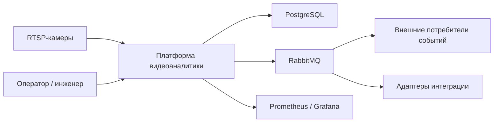
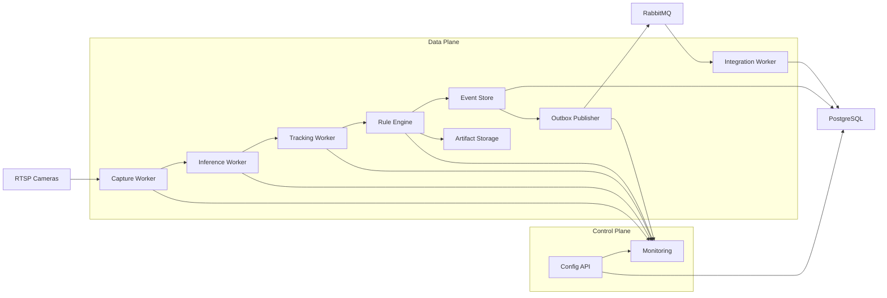
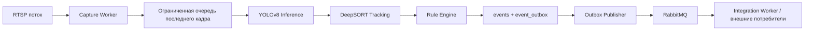
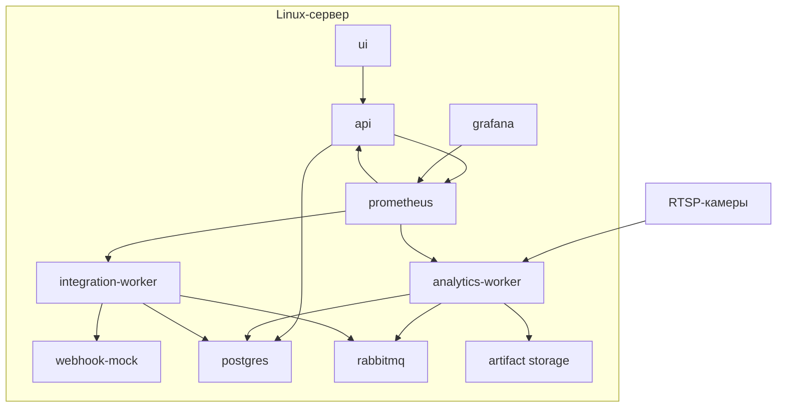

# Архитектурные решения платформы видеоаналитики реального времени

## 1. Введение

Цель магистерской работы состоит в повышении эффективности автоматизированного мониторинга охраняемых зон за счет разработки и экспериментальной оценки платформы видеоаналитики реального времени, обеспечивающей обнаружение, сопровождение и событийный анализ объектов, а также генерацию уведомлений с заданными показателями точности, задержки обработки и надежности доставки событий. Следовательно, архитектура платформы должна решать не только задачу программной композиции модулей, но и задачу согласования алгоритмов компьютерного зрения с эксплуатационными требованиями реального времени.

В качестве базового сценария эксплуатации принимается экспериментальная установка на одном Linux-сервере, обслуживающая от 1 до 10 RTSP-камер. Такой масштаб соответствует реалистичной конфигурации для исследовательской и пилотной эксплуатации, позволяет воспроизводимо проводить эксперименты и при этом не приводит к избыточной операционной сложности. Базовый стек платформы включает `Python`, `FastAPI`, `PyAV/FFmpeg`, `Ultralytics YOLOv8`, `DeepSORT`, `PostgreSQL`, `RabbitMQ`, `Docker Compose`, `Prometheus` и `Grafana`.

Архитектурные решения в данном документе выводятся из целей работы, задач исследования и требований, зафиксированных в материалах по теме и постановке задачи. Ключевыми критериями корректности архитектуры считаются:

- возможность обработки видеопотоков с ограниченной задержкой;
- устойчивость сопровождения объектов в многокадровом анализе;
- интерпретируемость событийного анализа за счет явной связи события с правилом, зоной и траекторией;
- надежная фиксация и доставка событий внешним потребителям;
- расширяемость платформы без полной переработки конвейера.

## 2. Архитектурные драйверы

### 2.1. Функциональные драйверы

К архитектурно значимым функциональным требованиям относятся:

- прием нескольких видеопотоков от камер наблюдения и их непрерывная обработка;
- выделение целевых объектов в кадре с определением класса, координат и оценки достоверности;
- сопровождение объектов во времени с присвоением устойчивых идентификаторов;
- поддержка нескольких классов объектов, включая людей, транспортные средства и БПЛА;
- формирование событий на основе пространственно-временных правил, связанных с зонами контроля и виртуальными рубежами;
- сохранение событий, параметров траекторий и конфигурации платформы;
- передача уведомлений внешним потребителям через программные интерфейсы и асинхронный канал интеграции;
- изменение состава зон, правил и параметров камер без переписывания базовой логики платформы.

### 2.2. Нефункциональные драйверы

Ключевые нефункциональные требования, определяющие архитектуру, приведены в таблице.

| Драйвер | Архитектурное следствие |
|---|---|
| Работа в реальном времени | В hot path запрещены бесконечные очереди и тяжелые синхронные интеграции; допустимо отбрасывание устаревших кадров ради актуальности результата |
| Масштабируемость | Требуется изоляция обработки по камерам и разделение компонентов на независимые сервисы в пределах одного узла |
| Отказоустойчивость | Сбой одной камеры, внешнего получателя или брокера не должен останавливать всю платформу |
| Интерпретируемость | Событие должно объясняться через правило, траекторию, камеру и геометрию зоны |
| Интегрируемость | Результаты должны иметь устойчивые API-контракты и версионированные сообщения |
| Расширяемость | Замена детектора, трекера или способа доставки событий должна быть локальной, а не системной |
| Воспроизводимость экспериментов | Online-контур эксплуатации должен быть отделен от offline-контура обучения и экспериментальной оценки |

Совокупность этих драйверов приводит к выводу, что оптимальным решением для текущей стадии проекта является односерверная модульная архитектура с четким разделением зон ответственности, асинхронной публикацией событий и отдельным контуром управления конфигурацией.

## 3. Выбранный архитектурный стиль

### 3.1. Базовый стиль

В качестве базового стиля выбрана модульная событийно-ориентированная архитектура на одном сервере с разделением на `control plane` и `data plane`.

`Control plane` отвечает за:

- управление конфигурацией камер;
- описание зон контроля и виртуальных линий;
- управление правилами событийного анализа;
- просмотр и фильтрацию журнала событий;
- публикацию health- и metrics-интерфейсов.

`Data plane` отвечает за:

- прием RTSP-потоков;
- декодирование кадров;
- детекцию объектов;
- сопровождение объектов;
- применение событийных правил;
- фиксацию событий;
- публикацию событий в интеграционный канал.

Такой стиль выбран потому, что для диапазона `1-10` камер полноценная микросервисная кластерная архитектура создаст лишние затраты на сопровождение, а неструктурированный монолит затруднит объяснение архитектурных границ, масштабирование и последующее развитие платформы. Модульная композиция на одном узле дает приемлемый баланс простоты реализации, малой задержки и инженерной дисциплины.

### 3.2. Разделение online и offline контуров

Архитектура платформы должна разделять два независимых контура.

| Контур | Назначение | Причина разделения |
|---|---|---|
| Online runtime contour | Непрерывная обработка видеопотоков, генерация и доставка событий | Требуются стабильность, контролируемая задержка и воспроизводимое поведение |
| Offline research contour | Обучение, дообучение, сравнение моделей, подготовка датасетов, вычислительные эксперименты | Эксперименты не должны влиять на эксплуатационный контур и искажать результаты измерений |

Разделение контуров особенно важно для магистерской работы, поскольку позволяет отдельно оценивать алгоритмическое качество модели и эксплуатационные свойства платформы.

### 3.3. Контекстная диаграмма



## 4. Логическая структура платформы

### 4.1. Компоненты и их ответственности

| Компонент | Ответственность | Вход | Выход |
|---|---|---|---|
| `Config API` | CRUD камер, зон, правил, просмотр событий, health/metrics, управление конфигурацией | HTTP-запросы | Конфигурация в БД, ответы API |
| `Capture Worker` | Подключение к RTSP, декодирование кадров, reconnection, нормализация таймштампов | RTSP-поток | Актуальные кадры в ограниченную очередь |
| `Inference Worker` | Детекция объектов на актуальных кадрах, использование GPU или CPU | Кадры | Список детекций |
| `Tracking Worker` | Поддержка состояний треков отдельно по каждой камере | Детекции | Траектории и устойчивые `track_id` |
| `Rule Engine` | Применение зон и правил к траекториям, дедупликация событий | Треки, зоны, правила | Структурированные события |
| `Event Store` | Сохранение событий и записей `event_outbox` | События | `events`, `event_outbox` |
| `Outbox Publisher` | Публикация событий в `RabbitMQ` с confirm и повторной отправкой | `event_outbox` | Сообщения брокера |
| `Integration Worker` | Доставка во внешние системы, журнал попыток доставки, обработка ошибок | Сообщения `RabbitMQ` | Статусы доставки, вызовы webhook или других API |
| `Artifact Storage` | Сохранение снапшотов и коротких клипов по событиям | Кадры, фрагменты потока | Файл на диске и путь в БД |
| `Monitoring` | Сбор метрик, визуализация и диагностика работы | Метрики приложений | Панели наблюдаемости и алерты |

### 4.2. Компонентная диаграмма



## 5. Алгоритмический конвейер обработки

Обработка видеопотоков строится как последовательность взаимосвязанных стадий:

1. Камера отдает RTSP-поток в `Capture Worker`.
2. `Capture Worker` выполняет декодирование потока через `FFmpeg/PyAV`, нормализует временные метки и помещает только последний актуальный кадр в ограниченную очередь.
3. `Inference Worker` извлекает кадр из очереди и запускает модель `YOLOv8`.
4. `Tracking Worker` обновляет состояние `DeepSORT` для конкретной камеры и формирует траектории объектов.
5. `Rule Engine` проверяет траектории относительно зон контроля, виртуальных линий и временных порогов.
6. При выполнении условия создается структурированное событие, содержащее тип, время, приоритет, ссылку на правило и связанные объекты.
7. Событие в одной транзакции записывается в таблицы `events` и `event_outbox`.
8. `Outbox Publisher` публикует событие в `RabbitMQ` с подтверждением доставки.
9. `Integration Worker` доставляет событие внешнему потребителю или во внешний API-адаптер и фиксирует результат.
10. При необходимости по событию формируется снимок или короткий клип; в базе данных сохраняется ссылка на артефакт.

### 5.1. Диаграмма потока данных



## 6. Архитектурные решения с обоснованием

### ADR-01. Односерверная модульная архитектура с разделением на control plane и data plane

**Проблема.** Платформе необходимо одновременно обеспечивать малую задержку обработки, инженерную структурированность и возможность дальнейшего развития без полной переработки решения.

**Решение.** Выбрать односерверную модульную архитектуру, в которой `control plane` отвечает за управление конфигурацией и наблюдаемость, а `data plane` обслуживает потоковую обработку видео и генерацию событий.

**Почему выбрано.** Для масштаба `1-10` камер микросервисный кластер не даст существенного выигрыша, но усложнит развертывание, измерение характеристик и объяснение результата в рамках ВКР. Вместе с тем неструктурированный монолит ухудшит изоляцию компонентов и усложнит дальнейший вынос отдельных сервисов.

**Что это дает.**

- низкую задержку за счет локального взаимодействия компонентов;
- понятные границы ответственности;
- возможность последующего перехода к распределенной схеме без смены ключевых контрактов.

### ADR-02. Разделение online runtime и offline research контуров

**Проблема.** Эксплуатационная обработка видео и исследовательские эксперименты с моделями имеют разные требования к стабильности и воспроизводимости.

**Решение.** Жестко разделить online-контур непрерывной обработки видеопотоков и offline-контур обучения, дообучения и экспериментальной оценки моделей.

**Почему выбрано.** Эксперименты с новыми весами, гиперпараметрами и датасетами не должны влиять на стабильность эксплуатационного контура. Кроме того, раздельная организация контуров облегчает доказательство результатов экспериментов и воспроизводимость измерений.

**Что это дает.**

- предсказуемое поведение runtime-системы;
- корректное сравнение моделей в offline-среде;
- аккуратное разделение исследовательской и эксплуатационной логики.

### ADR-03. Прием видеопотоков через RTSP с декодированием в FFmpeg/PyAV

**Проблема.** Потоки от камер могут быть нестабильными, содержать сетевые разрывы и требовать контроля буферизации.

**Решение.** Использовать `RTSP` в качестве основного протокола получения видеоданных и декодировать поток средствами `FFmpeg/PyAV`. `OpenCV` применять для обработки кадров, визуализации и постобработки, но не как основной транспортный слой.

**Почему выбрано.** `OpenCV VideoCapture` подходит для прототипов, но хуже управляет размером буфера, политикой переподключения и характеристиками потока при ошибках сети. `FFmpeg/PyAV` предоставляет более устойчивый и управляемый механизм работы с видеотранспортом.

**Что это дает.**

- контролируемое переподключение к камерам;
- более предсказуемое поведение при сетевых сбоях;
- разделение задач транспортного слоя и CV-обработки.

### ADR-04. Организация hot path на основе ограниченной очереди последнего актуального кадра

**Проблема.** При перегрузке по FPS или при росте времени инференса бесконечные очереди приводят к накоплению задержки и потере актуальности результата.

**Решение.** Для каждой камеры выделить отдельный `Capture Worker`, а между этапами захвата и инференса использовать ограниченную очередь или буфер типа "последний актуальный кадр". Устаревшие кадры при перегрузке отбрасываются.

**Почему выбрано.** Для задач охраны критична своевременность реакции на событие, а не обработка каждого кадра без исключения. Если система обрабатывает все кадры с большой задержкой, оператор получает устаревшие сигналы, что снижает практическую ценность платформы.

**Что это дает.**

- ограничение общей latency;
- устойчивость к кратковременным всплескам нагрузки;
- реализацию принципа "свежесть важнее полноты".

### ADR-05. Детектор объектов семейства YOLOv8

**Проблема.** Необходимо совместить приемлемую точность обнаружения и скорость обработки видеопотоков в реальном времени.

**Решение.** В качестве базового детектора использовать `YOLOv8` в Python-стеке, предусмотрев возможность экспорта модели в `ONNX` или `TensorRT` как путь последующей оптимизации.

**Почему выбрано.** Выбор сохраняет преемственность с бакалаврской работой, соответствует уже проведенному обоснованию семейства `YOLO` и обеспечивает разумный компромисс между точностью и скоростью. При этом экспорт в более оптимизированные форматы не является обязательным стартовым условием, а выступает как механизм масштабирования производительности.

**Что это дает.**

- быструю интеграцию детектора в платформу;
- воспроизводимую экспериментальную базу;
- понятный путь дальнейшей оптимизации без смены алгоритмической логики.

### ADR-06. Сопровождение объектов методом DeepSORT с изоляцией состояния по камерам

**Проблема.** Покадровая детекция сама по себе не позволяет анализировать поведение объектов, длительность нахождения в зоне и направление движения.

**Решение.** Использовать `DeepSORT` как базовый трекер; состояние треков вести отдельно по каждой камере.

**Почему выбрано.** `DeepSORT` сочетает модель движения и признаки внешнего вида, что снижает число переключений идентификаторов по сравнению с чисто кинематическими трекерами. Изоляция состояния по камерам исключает межкамерные конфликты идентификаторов и локализует ошибки.

**Что это дает.**

- устойчивые `track_id` для событийного анализа;
- лучшую работу при перекрытиях и временных потерях детекций;
- независимость камер друг от друга в runtime-контуре.

### ADR-07. Правиловой событийный анализ на основе траекторий и зон

**Проблема.** Системе требуется формировать объяснимые события, адаптируемые под локальные регламенты объекта, без обязательного переобучения модели под каждый сценарий.

**Решение.** Генерацию событий строить на правилах над траекториями и геометрией сцен: пересечение виртуальной линии, вход в запретную зону, длительное нахождение, появление объекта определенного класса в заданном секторе и тому подобное.

**Почему выбрано.** Нейросетевое распознавание событий по видеоклипам перспективно, но в практико-ориентированной системе хуже интерпретируется и требует отдельных объемных датасетов событий. Правиловой подход прозрачен, управляем и напрямую связан с эксплуатационными сценариями.

**Что это дает.**

- интерпретируемость результата;
- гибкую настройку под объект наблюдения;
- слабую зависимость событийной логики от конкретного детектора и трекера.

### ADR-08. Асинхронная интеграция через RabbitMQ только для событий и служебных сообщений

**Проблема.** Платформе требуется надежно и слабо связанно отдавать результаты внешним системам, не ухудшая характеристики hot path.

**Решение.** Использовать `RabbitMQ` как основной канал асинхронной интеграции для событий и служебных сообщений. Видео-кадры, сырые детекции и другие high-volume данные через брокер не передавать.

**Почему выбрано.** Для событий поток сообщений сравнительно невелик, но надежность доставки критична. Передача видео через брокер привела бы к избыточной сериализации, росту нагрузки на сеть и увеличению задержки.

**Что это дает.**

- развязку аналитического контура и внешних потребителей;
- возможность повторной доставки событий;
- сохранение малой задержки на основном пути обработки кадров.

### ADR-09. PostgreSQL как системное хранилище конфигурации и событий

**Проблема.** Необходимо централизованно хранить конфигурацию, правила, события и служебные записи доставки, не превращая БД в архив всех видеоданных.

**Решение.** Использовать `PostgreSQL` для хранения конфигурации камер, зон, правил, событий, состояний доставки и ссылок на артефакты. Снапшоты и клипы хранить на локальном диске, а в БД сохранять только пути и метаданные. Полный поток кадров и все сырые детекции не записывать постоянно.

**Почему выбрано.** `PostgreSQL` обеспечивает транзакционность, надежность и удобную работу со структурированными данными. Хранение бинарного видео в БД создало бы ненужное раздувание объема и ухудшило сопровождение.

**Что это дает.**

- единый источник конфигурационной и событийной правды;
- удобную поддержку транзакционных сценариев;
- приемлемые требования к дисковой подсистеме.

### ADR-10. Надежная доставка событий через transactional outbox

**Проблема.** При временной недоступности брокера уже сформированные события нельзя терять, иначе результаты аналитики окажутся неполными.

**Решение.** Использовать связку `events + event_outbox` в `PostgreSQL` и выделенный `Outbox Publisher`, который публикует события в `RabbitMQ` с подтверждением доставки. Очереди брокера должны быть `durable`, потребители обязаны использовать `ack`, для ошибочных сообщений должна существовать `DLQ`.

**Почему выбрано.** Паттерн transactional outbox позволяет сначала надежно зафиксировать событие в БД, а затем асинхронно доставить его во внешний канал. Это устраняет гонку между записью события и публикацией сообщения.

**Что это дает.**

- отсутствие потери событий при временной недоступности брокера;
- управляемые повторные публикации;
- проверяемую надежность интеграционного контура.

### ADR-11. Наблюдаемость как обязательное свойство архитектуры

**Проблема.** Без измеримости невозможно доказать достижение цели работы по задержке, устойчивости и надежности.

**Решение.** Экспортировать обязательные метрики через `/metrics`, публиковать `health/live` и `health/ready`, собирать технические показатели в `Prometheus` и визуализировать их в `Grafana`.

Обязательный набор метрик:

- входной FPS по каждой камере;
- FPS после отбора актуальных кадров;
- длина очередей и число отбрасываемых кадров;
- latency инференса;
- latency "объект -> событие";
- число переподключений к RTSP-источнику;
- число ошибок публикации в брокер;
- число повторных доставок и попаданий в `DLQ`.

**Почему выбрано.** Экспериментальная оценка платформы невозможна без количественного контроля производительности и устойчивости. Наблюдаемость здесь выступает не вспомогательной, а исследовательской функцией.

**Что это дает.**

- доказуемость заявленных характеристик;
- возможность локализовать узкие места;
- подготовку объективных данных для главы апробации.

### ADR-12. Развертывание через Docker Compose на одном сервере

**Проблема.** Нужен воспроизводимый способ развертывания экспериментальной платформы без избыточной инфраструктурной сложности.

**Решение.** Развертывать систему через `Docker Compose` на одном Linux-сервере. Минимальный состав сервисов: `api`, `analytics-worker`, `integration-worker`, `ui`, `webhook-mock`, `postgres`, `rabbitmq`, `prometheus`, `grafana`.

**Почему выбрано.** Такое решение достаточно конкретно для ВКР, поддерживает воспроизводимость и не требует сопровождения оркестратора уровня Kubernetes на стадии исследования.

**Что это дает.**

- повторяемость экспериментов;
- простое развертывание на испытательном стенде;
- подготовленную основу для дальнейшего вынесения компонентов в отдельные узлы.

### ADR-13. Включение JWT-аутентификации, RBAC и операторского UI в первую версию

**Проблема.** Для практической проверки эксплуатационного контура необходимо не только API-управление, но и защищенный пользовательский доступ к конфигурации, событиям и статусам системы.

**Решение.** Включить в первую версию платформы полноценный операторский интерфейс и контур безопасности: `JWT` (access + refresh), хранение refresh-токенов в БД, роли `admin`/`operator`/`viewer`, а также ограничение операций API на основе RBAC.

**Почему выбрано.** Такой подход позволяет в рамках одной версии одновременно проверить корректность ролей, безопасность доступа к конфигурации и пригодность платформы для операторской работы без ручных запросов к API.

**Что это дает.**

- контролируемый доступ к данным и операциям;
- готовность к демонстрации сквозного сценария эксплуатации;
- снижение риска несанкционированного изменения правил и параметров камер.

## 7. Публичные интерфейсы и основные типы данных

### 7.1. REST API

REST-интерфейс предназначен для управления конфигурацией и чтения результатов, но не участвует в hot path обработки кадров.

| Endpoint | Назначение |
|---|---|
| `POST /api/v1/auth/login` | Получение `access` и `refresh` токенов |
| `POST /api/v1/auth/refresh` | Обновление токенов |
| `POST /api/v1/auth/logout` | Отзыв refresh-токена |
| `GET /api/v1/auth/me` | Получение профиля и ролей текущего пользователя |
| `GET /api/v1/users` | Список пользователей (роль `admin`) |
| `POST /api/v1/users` | Создание пользователя и назначение ролей (роль `admin`) |
| `POST /api/v1/cameras` | Добавление камеры |
| `GET /api/v1/cameras` | Список камер и их статусов |
| `PATCH /api/v1/cameras/{camera_id}` | Изменение параметров камеры |
| `POST /api/v1/zones` | Создание или обновление зоны контроля |
| `POST /api/v1/rules` | Создание или обновление правила событийного анализа |
| `GET /api/v1/events` | Просмотр журнала событий с фильтрами |
| `GET /health/live` | Проверка живости процесса |
| `GET /health/ready` | Проверка готовности зависимостей |
| `GET /metrics` | Экспорт метрик в формате `Prometheus` |

### 7.2. Основные сущности БД

| Сущность | Минимальные поля | Назначение |
|---|---|---|
| `cameras` | `camera_id`, `name`, `rtsp_url`, `status`, `fps_target`, `resolution`, `created_at` | Хранение конфигурации камер |
| `zones` | `zone_id`, `camera_id`, `name`, `geometry`, `zone_type`, `created_at` | Геометрия зон и виртуальных линий |
| `rules` | `rule_id`, `camera_id`, `rule_type`, `params`, `severity`, `enabled` | Параметры событийных правил |
| `tracks` | `track_id`, `camera_id`, `object_class`, `started_at`, `last_seen_at`, `last_bbox`, `state` | Сведения о сопровождаемых объектах |
| `events` | `event_id`, `camera_id`, `track_id`, `rule_id`, `event_type`, `severity`, `occurred_at`, `confidence`, `snapshot_path`, `dedup_key` | Журнал событий |
| `event_outbox` | `outbox_id`, `event_id`, `payload`, `status`, `retry_count`, `next_retry_at` | Буфер публикации сообщений |
| `delivery_attempts` | `attempt_id`, `event_id`, `consumer_name`, `status`, `attempted_at`, `error_text` | История интеграционных попыток |

### 7.3. Контракт события в брокере

Сообщения, публикуемые в `RabbitMQ`, должны быть версионированными и самодостаточными. Базовый контракт имеет следующий вид:

```json
{
  "schema_version": 1,
  "event_id": "uuid",
  "event_type": "zone_enter",
  "camera_id": "cam-01",
  "track_id": "trk-183",
  "object_class": "drone",
  "confidence": 0.91,
  "occurred_at": "2026-03-07T10:15:32Z",
  "zone_id": "zone-perimeter-a",
  "rule_id": "rule-drone-enter",
  "severity": "high",
  "snapshot_path": "/data/artifacts/2026/03/07/event-123.jpg",
  "dedup_key": "cam-01:rule-drone-enter:trk-183",
  "attributes": {
    "direction": "inbound"
  }
}
```

Поле `dedup_key` необходимо для подавления повторной генерации и повторной доставки одного и того же факта. Поле `schema_version` обеспечивает эволюцию контракта без нарушения совместимости с внешними потребителями.

## 8. Механизмы реального времени, отказоустойчивости и масштабирования

### 8.1. Обеспечение работы в реальном времени

Архитектура поддерживает режим, близкий к реальному времени, за счет следующих решений:

- обработка строится по принципу "свежесть важнее полноты", поэтому устаревшие кадры допускается отбрасывать;
- детектор и трекер разделены, чтобы дорогостоящий GPU-ресурс использовать для инференса, а состояние треков поддерживать локально и дешево;
- состояние треков изолировано по камерам, поэтому перегрузка или сбой одной камеры не распространяется на остальные;
- брокер сообщений исключен из hot path кадров, что уменьшает задержку;
- конфигурация зон и правил может обновляться без изменения кода и без полной остановки платформы.

### 8.2. Обеспечение надежности

Надежность платформы обеспечивается следующими мерами:

- временная недоступность камеры приводит к деградации только обработки данной камеры;
- `Capture Worker` обязан поддерживать автоматическое переподключение и фиксировать число попыток восстановления;
- временная недоступность `RabbitMQ` не приводит к потере событий благодаря `event_outbox`;
- очереди брокера объявляются как `durable`, публикация сопровождается confirm, потребители подтверждают обработку через `ack`;
- для сообщений, не доставленных после исчерпания лимита повторных попыток, используется `DLQ`;
- повторная доставка реализуется как идемпотентная на уровне внешнего адаптера или потребителя.

Следует отметить, что в односерверной конфигурации отказоустойчивость достигается на уровне процесса, компонента и интеграционного контрагента. Полноценная кластерная высокая доступность (HA) не входит в текущий объем проекта и рассматривается как направление развития.

### 8.3. Масштабирование

Целевая конфигурация текущего этапа: один сервер, `1-10` камер.

В рамках этой конфигурации применяются следующие механизмы масштабирования:

- вертикальное масштабирование по CPU, GPU, памяти и дисковой подсистеме;
- изменение числа worker-процессов для аналитического контура;
- вынесение `analytics-worker` и `integration-worker` в отдельные узлы без изменения контрактов событий;
- последующая кластеризация `RabbitMQ` и `PostgreSQL` как следующий этап эволюции, но не как свойство первой версии.

Таким образом, архитектура не претендует на мгновенную готовность к крупному распределенному развертыванию, но заранее строится так, чтобы путь перехода к нему не требовал изменения фундаментальных интерфейсов.

## 9. Топология развертывания на одном сервере



Минимальный состав сервисов:

| Сервис | Назначение |
|---|---|
| `ui` | Операторский интерфейс: аутентификация, конфигурация, события, статусы |
| `api` | Конфигурация, просмотр событий, JWT/RBAC, health и metrics |
| `analytics-worker` | Захват видеопотоков, детекция, трекинг, событийный анализ, запись outbox |
| `integration-worker` | Публикация и доставка событий внешним системам |
| `webhook-mock` | Тестовый внешний потребитель для проверки доставки |
| `postgres` | Хранение конфигурации, событий и статусов доставки |
| `rabbitmq` | Асинхронный транспорт событий |
| `prometheus` | Сбор метрик |
| `grafana` | Панели мониторинга |
| `artifact storage` | Локальное хранение снапшотов и клипов |

## 10. Тестовые сценарии и критерии приемки архитектуры

Архитектурные решения считаются подтвержденными, если платформа поддерживает следующие сценарии:

| Сценарий | Проверяемое свойство | Ожидаемый результат |
|---|---|---|
| Обработка нормального потока от одной камеры | Базовая работоспособность конвейера | События формируются и фиксируются без потерь |
| Одновременная обработка нескольких камер | Изоляция камер и масштабируемость | Сбой или перегрузка одной камеры не блокирует другие |
| Кратковременный разрыв RTSP-потока | Восстановление после сетевых проблем | Обработка возобновляется автоматически после reconnect |
| Перегрузка по входному FPS | Контроль latency | Устаревшие кадры отбрасываются, суммарная задержка не растет неограниченно |
| Пересечение виртуальной линии | Корректность rule engine | Событие формируется однократно при выполнении условия |
| Повторное выполнение того же правила для того же факта | Дедупликация | Повторное уведомление подавляется через `dedup_key` |
| Временная недоступность `RabbitMQ` | Надежность доставки | Событие сохраняется в outbox и публикуется после восстановления брокера |
| Отказ внешнего потребителя | Повторная доставка | Ошибка фиксируется, сообщение повторяется по политике retry |
| Изменение зон и правил без изменения кода | Управляемость конфигурации | Параметры применяются через API и БД без переписывания логики |
| Сбор метрик и health-статусов | Наблюдаемость | Доступны измеримые показатели производительности и состояния системы |

Ключевые метрики, подлежащие фиксации в экспериментах:

- точность обнаружения объектов;
- устойчивость сопровождения, включая число переключений идентификаторов;
- корректность генерации событий, включая ложные и пропущенные события;
- суммарная задержка от появления объекта в кадре до публикации события;
- надежность доставки уведомлений.

## 11. Ограничения архитектуры и путь эволюции

Текущая архитектура осознанно ограничена рамками экспериментальной платформы и имеет следующие границы применимости:

- односерверное развертывание не обеспечивает полноценной кластерной отказоустойчивости;
- хранение артефактов на локальном диске упрощает стенд, но не является оптимальным вариантом для крупного промышленного внедрения;
- `DeepSORT` обеспечивает устойчивое сопровождение в рамках одной камеры, но не решает межкамерную реидентификацию;
- правиловой событийный анализ удобен и интерпретируем, однако сложные составные сценарии могут потребовать гибридизации с обучаемыми моделями высокого уровня;
- базовый стек ориентирован на RTSP-источники и не охватывает все возможные транспортные протоколы и edge-устройства.

Путь дальнейшего развития архитектуры включает:

1. вынос `analytics-worker` на отдельные вычислительные узлы;
2. переход от локального хранения артефактов к объектному хранилищу;
3. кластеризацию `RabbitMQ` и `PostgreSQL`;
4. добавление специализированных адаптеров внешней интеграции;
5. развитие правилового движка в сторону более сложных составных сценариев;
6. внедрение ускоренного инференса через `ONNX Runtime` или `TensorRT`;
7. расширение платформы механизмами межкамерной корреляции и реидентификации.

## 12. Связь архитектурных решений с задачами магистерской работы

| Задача исследования | Архитектурное покрытие |
|---|---|
| Сформировать функциональные и нефункциональные требования к платформе | Раздел "Архитектурные драйверы" |
| Обосновать выбор методов обнаружения, сопровождения и формирования событий | `ADR-05`, `ADR-06`, `ADR-07` |
| Разработать архитектуру и алгоритмический конвейер платформы | Разделы о стиле архитектуры, компонентах и потоке данных, а также `ADR-01` - `ADR-13` |
| Реализовать платформу с механизмами работы в реальном времени, отказоустойчивости и масштабируемости | `ADR-03`, `ADR-04`, `ADR-08`, `ADR-10`, `ADR-11`, `ADR-12`, `ADR-13` |
| Провести экспериментальную оценку | Раздел о метриках, сценариях проверки и наблюдаемости |
| Определить условия эффективного применения и направления дальнейшего развития | Раздел "Ограничения архитектуры и путь эволюции" |

Таким образом, архитектура платформы напрямую связана с логикой исследования и выступает не вспомогательным описанием реализации, а центральным механизмом достижения поставленной цели.

## 13. Принятые допущения и параметры по умолчанию

При проектировании приняты следующие допущения:

1. Платформа разворачивается на Linux-сервере и при наличии оборудования может использовать `NVIDIA GPU`, но должна поддерживать деградацию до CPU-only режима для экспериментов.
2. Основными источниками видеоданных являются RTSP-камеры наблюдения.
3. Основным интеграционным артефактом являются события, а не видеокадры.
4. Полнофункциональный операторский интерфейс входит в первую версию платформы и работает совместно с JWT/RBAC-контуром безопасности.
5. Базовый стек должен сохранять преемственность с предыдущими результатами по `Python`, `YOLO` и `DeepSORT`, но поднимать решение с уровня отдельных алгоритмов на уровень платформенной архитектуры.

## 14. Вывод

Предложенная архитектура ориентирована на практико-исследовательский сценарий разработки платформы видеоаналитики реального времени для охранного видеонаблюдения. Она сочетает алгоритмическую преемственность с предыдущими результатами, инженерную структурированность, интерпретируемый событийный анализ и надежную доставку событий. Выбранные архитектурные решения обеспечивают реалистичный баланс между точностью, задержкой, надежностью и масштабируемостью, что делает данную архитектуру обоснованной основой как для программной реализации, так и для экспериментальной оценки в последующих разделах магистерской работы.
